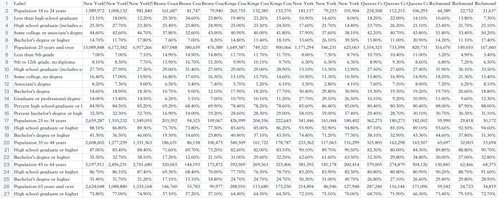
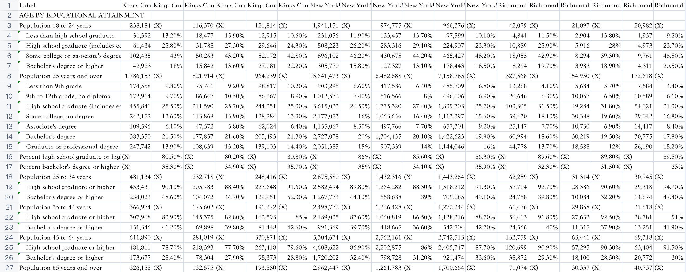
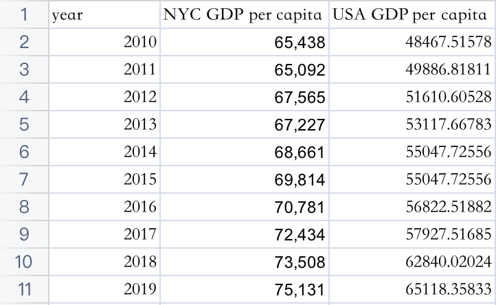

# Data sources
There are four parts of our datasets, namely, number of employed, salary, education and gdp.  

## Process of Data Collection
**List Variables**
* List variables related to employment conditions in New York City, for example, GDP in New York City, occupations, races, ages, genders, education levels, etc.
**Search with Keywords**
* Search these key words in google and filter suitable data sources.
**Select the website**
* Find a suitable website for reliable data, in our project, most of the data are from: United States Census (https://data.census.gov/cedsci/).
**Filter the Data**
* Use the `Advanced Search` function in the website to filter the data we are interested in.

## Logistics of Data Collection

**Authority**
* Find more official data sources. For example, we came across multiple data sources with the data we want during the searching process, but finally, we selected United States Census, which is the most authoritative one.
**Primitive**
Find the most primitive data source. For example, some websites provide data that have been processed. At this time, we will look for more primitive data sets and analyze the original data.
**Relevance**
Find the data tables that can show connections between variables. For later analysis, we need to get rid of over summarizing and find the data that can show the relationship between different variables, which requires as many variables as possible in the same data table.
**Unity**
Find the website that includes variety aspects of data. It can make the data in different databases more unified. For example, the data can be obtained with a unified data acquisition method in one website, and this will facilitate subsequent data analysis.

## Basic Information of Datasets

### `numemp` Datasets

#### Sources of `numemp`

In our project, we use `numemp` to represent `Number of Employed`. The data is divided into different sub-datasets according to years and races. The year range is from 2010 to 2019, and the races include `White Alone`, `Black or African American Alone`, `Asian Alone`, `Some Other Race Alone`, `Two or More Races`, `White Alone Not Hispanic or Latino`, and `Hispanic or Latino`. The raw data of `numemp` is attached to the following Github repo:
https://github.com/tracy3057/STAT5702_NYC_Employment_Analysis/tree/main/RawData/numemp
The origin data source urls are provided in:
https://github.com/tracy3057/STAT5702_NYC_Employment_Analysis/blob/main/RawData/numemp/datasource.txt

#### Basic Information

Each sub-dataset includes 73 records and 6 variables.

Variable names | Types of Variables | Types of Variables
------------- | ------------- | -------------
Label | Character | Occupation Type
Bronx County, New York / Estimate | Numeric |  Number of Employed in Bronx County
Kings County, New York / Estimate | Numeric | Number of Employed in Kings County
New York County, New York / Estimate | Numeric |  Number of Employed in New York County
Queens County, New York / Estimate | Numeric |  Number of Employed in Queens County
Richmond County, New York / Estimate / Estimate | Numeric |  Number of Employed in Richmond County

Take the data for White Alone in year 2019 as an example, the form of each dataset is as follows:

### `salary` Datasets

#### Sources of `salary`

The data is divided into different sub-datasets according to years. The year range is from 2010 to 2019. The raw data of `numemp` is attached to the following Github repo:
https://github.com/tracy3057/STAT5702_NYC_Employment_Analysis/tree/main/RawData/salary/CountySalary
The origin data source urls are provided in:
https://github.com/tracy3057/STAT5702_NYC_Employment_Analysis/blob/main/RawData/salary/datasource.txt

#### Basic Information

Each sub-dataset includes 73 records and 6 variables.

Variable names | Types of Variables | Types of Variables
------------- | ------------- | -------------
Label | Character | Occupation Type
Bronx County, New York!!Estimate | Character |  Salary in Bronx County
Kings County, New York!!stimate | Character | Salary in Kings County
New York County, New York!!Estimate | Character |  Salary in New York County
Queens County, New York!!Estimate | Character |  Salary in Queens County
Richmond County, New York!!Estimate!!Estimate | Character |  Salary in Richmond County

ps: The salary data has the data type of character due to the `,` in data.

Take the data for in year 2019 as an example, the form of each dataset is as follows:

### `education` Datasets

#### Sources of `education`

The data is divided into different sub-datasets according to years. The year range is from 2010 to 2019. The raw data of `numemp` is attached to the following Github repo:
https://github.com/tracy3057/STAT5702_NYC_Employment_Analysis/tree/main/RawData/education
The origin data source urls are provided in:
https://github.com/tracy3057/STAT5702_NYC_Employment_Analysis/blob/main/RawData/education/datasource.txt

#### Basic Information

For `education` dataset, the organization of data has small differences by years. The sub-datasets from 2010 to 2014 use the same organizing method, the sub-datasets from 2015 to 2018 use the same organizing method, the sub-dataset in 2019 use another organizing method.

**year 2010 to 2014**
From year 2010 to 2014, each sub-dataset includes 41 records and 19 variables.
The first column is named `Label`, it shows the names of different education levels. The type of this column is character.
The other columns include the information of percentages of different education levels in different counties. The type of these columns are character.
ps: The salary data has the data type of character due to the `,` and `%` in data.

Take the data for in year 2010 as an example, the form of each dataset is as follows:

**year 2015 to 2018**
From year 2015 to 2018, each sub-dataset includes 68 records and 37 variables.
The first column is named `Label`, it shows the names of different education levels. The type of this column is character.
The other columns include both percentages and exact number of different education levels in different counties. The type of these columns are character.

ps: The salary data has the data type of character due to the `,` and `%` in data.

Take the data for in year 2010 as an example, the form of each dataset is as follows:

**year 2019**
In year 2019, each sub-dataset includes 68 records and 19 variables.
The first column is named `Label`, it shows the names of different education levels. The type of this column is character.
The other columns include the exact number of different education levels in different counties. The type of these columns are character.

ps: The salary data has the data type of character due to the `,` in data.

Take the data for in year 2010 as an example, the form of each dataset is as follows:

### `gdp` Datasets
#### Sources of `gdp`

For gdp dataset, we include GDP per capita in both USA and NYC. The raw data of `gdp` is attached to the following Github repo:
https://github.com/tracy3057/STAT5702_NYC_Employment_Analysis/tree/main/RawData/gdp
The origin data source urls are provided in:
https://github.com/tracy3057/STAT5702_NYC_Employment_Analysis/blob/main/RawData/gdp/datasource.txt

#### Basic Information

Each sub-dataset includes 10 records and 3 variables.

Variable names | Types of Variables | Types of Variables
------------- | ------------- | -------------
year | Numeric | year 2010 - 2019
NYC GDP per capita | Numeric |  NYC GDP per capita in different years
USA GDP per capita | Numeric |  USA GDP per capita in different years

The form of `gdp` dataset is as follows:
{width=40%}

## Problems with Data

In the process of processing data, we encounter 5 major problems.

### Inconsistency in Occupation Names

When visualizing `numemp` dataset, we discover that for the occupation of `Fire fighting and prevention, and other protective service workers including supervisors` and `Education, training, and library occupations`, the value of some years were 0. Therefore, we came back to the origin dataset to check. 
We discover that for `Fire fighting and prevention, and other protective service workers including supervisors`, they are named with `Firefighting and prevention, and other protective service workers including supervisors` in some years, where **Fire fighting** is different from **Firefighting**.
Also, for `Education, training, and library occupations`, they are named with `Educational instruction, and library occupations` in some years, where **training** is different from **instruction** in character level.
Therefore, we unified these differences and solved this problem.

### Formating Problem Caused by File Download

For the datasets online, there is an inclusion relationship between the values for `Label`. As is shown in the example below.

However, after downloading the dataset, we cannot maintain this inclusion relationship. Instead, this relation is reflected by different numbers of spaces in each cell, which increases the difficulty of data processing. As is shown in the example below.

Also, the downloaded version of dataset does not have suitable column names, for it always combine the title and subtitle together. Therefore, we need to rename each column.

### Differences of Table Organizing Methods in Different Years.

In the `education` dataset, the organization of data table in differen years are different. Sometimes we need to multiply percentages by total amount of people in order to get the the number of people with some specific education levels. Sometimes we can use the number of people directly. Therefore, we need to analyze the organizing methods in different years first, then do the data process correspondingly.

### Characters in Numbers

In `salary` dataset and `education` dataset, there are `,` and `%` in numbers in raw data. We need to delete the characters and do some numerical conversions for the percentile.

#### Different Expressions of NAs

In some data tables, NAs are represented as (X) or -. We paid attention to the different representations and replaced them with NA for further processing.

