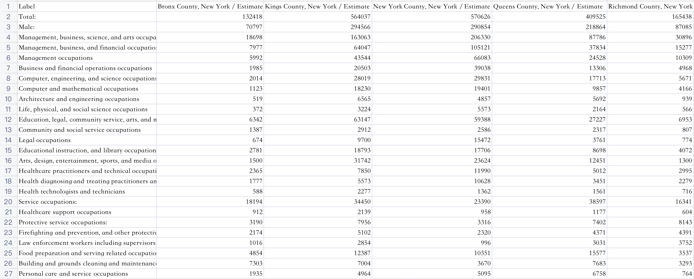
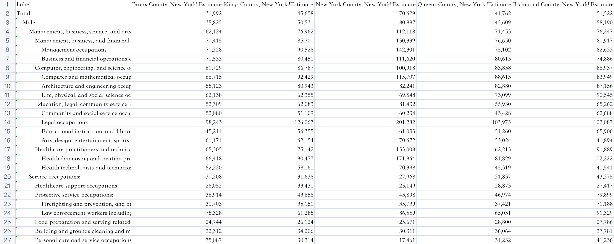
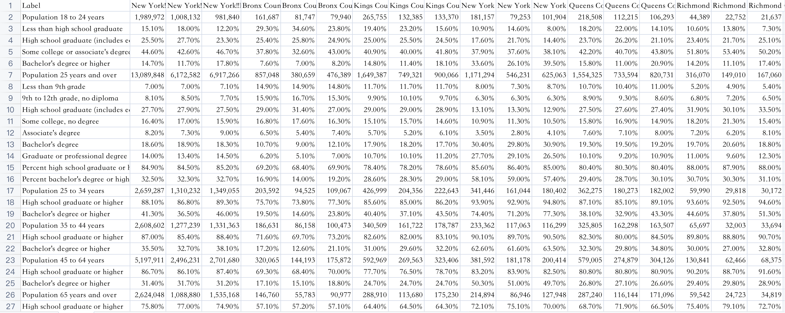
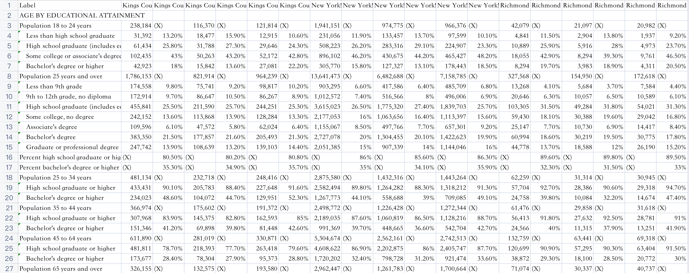
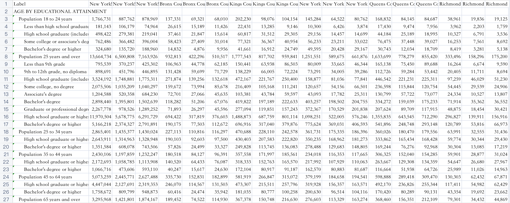
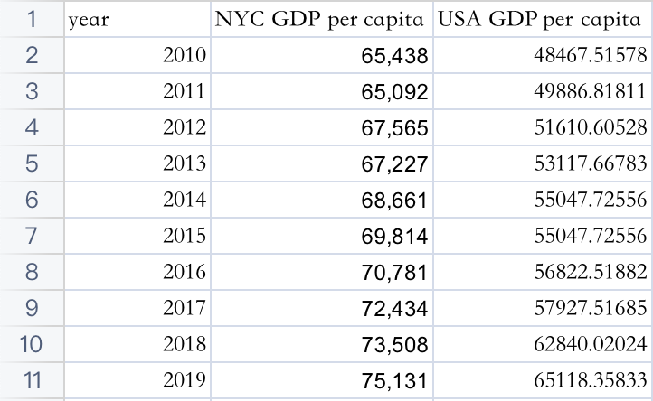
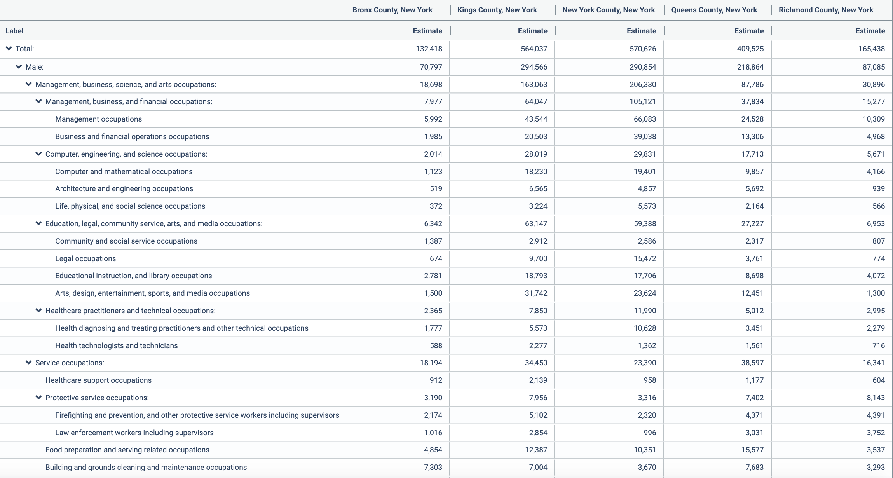
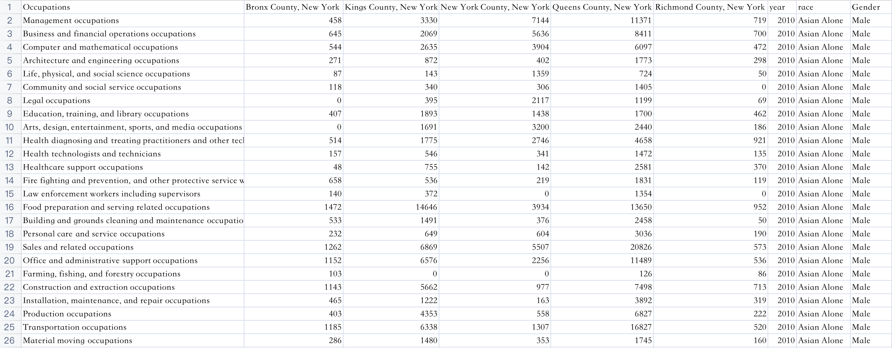
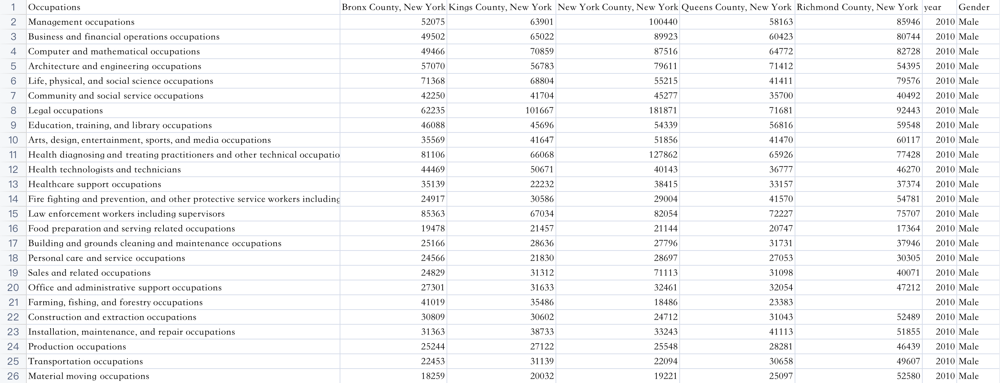

--- 
title: "NYC Employment Analysis"
author: "Xinyi Liu, Eugenio Beaufrand"
date: "`r Sys.Date()`"
site: bookdown::bookdown_site
---
```{r include=FALSE, cache=FALSE}
knitr::opts_chunk$set(
  echo = FALSE,
  message = FALSE,
  warning = FALSE
)
```

# Introduction

## Background
NYC might just be the city with the richest employment landscape in the world. From blue collar workers to big corporation executives, and strong representation from almost every ethnicity, New York has it all. In addition to this, it happens to be a city where the municipality as well as federal government sources provide detailed data about the employment landscape.These factors contribute to the New York as a good candidate for to conduct exploratory data analysis.

## Purpose
Explore employment and job data in NYC through the period 2010-2019. Potentially draw conclusions about the landscape with regards to employment, demographics, and salary.

## Areas of interest
Explore the employment of demographics (e.g: race, gender) and their fluctuations. Potential to find disparities in different demographics employment levels, explore reasons why this might be the case. Connect these disparities to this being a probabilistic tendency based on our intuition, current events at the time, or trends.

Explore the employment of people working in different fields. Explore trends in how likely certain sectors are to be employed and how this changes over time. See how this has reacted over our period to current events or trends.

Explore disparities by demographic of people working in different fields. Do people of different demographics prefer to work in certain fields? Does this correspond with our intuition on the matter.

Explore disparities in unemployment by demographic factors. See if there are demographic groups with a higher propensity for unemployment, explore the reasons as to why this might be the case.

Explore disparities in salary across demographics and also across different sectors.

## Data Sources
In the Github repository of this project, there is a Word Document 'DataSource' which can be consulted for the links to the data source. The employment data comes directly from the city of new york website and census.gov. The economic + job growth data comes from the nyc.gov website, census.gov.

<!--chapter:end:index.Rmd-->

```{r include=FALSE, cache=FALSE}
knitr::opts_chunk$set(
  echo = FALSE,
  message = FALSE,
  warning = FALSE
)
```
# Data sources
There are four parts of our datasets, namely, number of employed, salary, education and gdp.  

## Process of Data Collection
**List Variables**
* List variables related to employment conditions in New York City, for example, GDP in New York City, occupations, races, ages, genders, education levels, etc.
**Search with Keywords**
* Search these key words in google and filter suitable data sources.
**Select the website**
* Find a suitable website for reliable data, in our project, most of the data are from: United States Census (https://data.census.gov/cedsci/).
**Filter the Data**
* Use the `Advanced Search` function in the website to filter the data we are interested in.

## Logistics of Data Collection

**Authority**
* Find more official data sources. For example, we came across multiple data sources with the data we want during the searching process, but finally, we selected United States Census, which is the most authoritative one.
**Primitive**
Find the most primitive data source. For example, some websites provide data that have been processed. At this time, we will look for more primitive data sets and analyze the original data.
**Relevance**
Find the data tables that can show connections between variables. For later analysis, we need to get rid of over summarizing and find the data that can show the relationship between different variables, which requires as many variables as possible in the same data table.
**Unity**
Find the website that includes variety aspects of data. It can make the data in different databases more unified. For example, the data can be obtained with a unified data acquisition method in one website, and this will facilitate subsequent data analysis.

## Basic Information of Datasets

### `numemp` Datasets

#### Sources of `numemp`

In our project, we use `numemp` to represent `Number of Employed`. The data is divided into different sub-datasets according to years and races. The year range is from 2010 to 2019, and the races include `White Alone`, `Black or African American Alone`, `Asian Alone`, `Some Other Race Alone`, `Two or More Races`, `White Alone Not Hispanic or Latino`, and `Hispanic or Latino`. The raw data of `numemp` is attached to the following Github repo:
https://github.com/tracy3057/STAT5702_NYC_Employment_Analysis/tree/main/RawData/numemp
The origin data source urls are provided in:
https://github.com/tracy3057/STAT5702_NYC_Employment_Analysis/blob/main/RawData/numemp/datasource.txt

#### Basic Information

Each sub-dataset includes 73 records and 6 variables.

Variable names | Types of Variables | Types of Variables
------------- | ------------- | -------------
Label | Character | Occupation Type
Bronx County, New York / Estimate | Numeric |  Number of Employed in Bronx County
Kings County, New York / Estimate | Numeric | Number of Employed in Kings County
New York County, New York / Estimate | Numeric |  Number of Employed in New York County
Queens County, New York / Estimate | Numeric |  Number of Employed in Queens County
Richmond County, New York / Estimate / Estimate | Numeric |  Number of Employed in Richmond County

Take the data for White Alone in year 2019 as an example, the form of each dataset is as follows:


### `salary` Datasets

#### Sources of `salary`

The data is divided into different sub-datasets according to years. The year range is from 2010 to 2019. The raw data of `numemp` is attached to the following Github repo:
https://github.com/tracy3057/STAT5702_NYC_Employment_Analysis/tree/main/RawData/salary/CountySalary
The origin data source urls are provided in:
https://github.com/tracy3057/STAT5702_NYC_Employment_Analysis/blob/main/RawData/salary/datasource.txt

#### Basic Information

Each sub-dataset includes 73 records and 6 variables.

Variable names | Types of Variables | Types of Variables
------------- | ------------- | -------------
Label | Character | Occupation Type
Bronx County, New York!!Estimate | Character |  Salary in Bronx County
Kings County, New York!!stimate | Character | Salary in Kings County
New York County, New York!!Estimate | Character |  Salary in New York County
Queens County, New York!!Estimate | Character |  Salary in Queens County
Richmond County, New York!!Estimate!!Estimate | Character |  Salary in Richmond County

ps: The salary data has the data type of character due to the `,` in data.

Take the data for in year 2019 as an example, the form of each dataset is as follows:


### `education` Datasets

#### Sources of `education`

The data is divided into different sub-datasets according to years. The year range is from 2010 to 2019. The raw data of `numemp` is attached to the following Github repo:
https://github.com/tracy3057/STAT5702_NYC_Employment_Analysis/tree/main/RawData/education
The origin data source urls are provided in:
https://github.com/tracy3057/STAT5702_NYC_Employment_Analysis/blob/main/RawData/education/datasource.txt

#### Basic Information

For `education` dataset, the organization of data has small differences by years. The sub-datasets from 2010 to 2014 use the same organizing method, the sub-datasets from 2015 to 2018 use the same organizing method, the sub-dataset in 2019 use another organizing method.

**year 2010 to 2014**
From year 2010 to 2014, each sub-dataset includes 41 records and 19 variables.
The first column is named `Label`, it shows the names of different education levels. The type of this column is character.
The other columns include the information of percentages of different education levels in different counties. The type of these columns are character.
ps: The salary data has the data type of character due to the `,` and `%` in data.

Take the data for in year 2010 as an example, the form of each dataset is as follows:

**year 2015 to 2018**
From year 2015 to 2018, each sub-dataset includes 68 records and 37 variables.
The first column is named `Label`, it shows the names of different education levels. The type of this column is character.
The other columns include both percentages and exact number of different education levels in different counties. The type of these columns are character.

ps: The salary data has the data type of character due to the `,` and `%` in data.

Take the data for in year 2010 as an example, the form of each dataset is as follows:

**year 2019**
In year 2019, each sub-dataset includes 68 records and 19 variables.
The first column is named `Label`, it shows the names of different education levels. The type of this column is character.
The other columns include the exact number of different education levels in different counties. The type of these columns are character.

ps: The salary data has the data type of character due to the `,` in data.

Take the data for in year 2010 as an example, the form of each dataset is as follows:

### `gdp` Datasets
#### Sources of `gdp`

For gdp dataset, we include GDP per capita in both USA and NYC. The raw data of `gdp` is attached to the following Github repo:
https://github.com/tracy3057/STAT5702_NYC_Employment_Analysis/tree/main/RawData/gdp
The origin data source urls are provided in:
https://github.com/tracy3057/STAT5702_NYC_Employment_Analysis/blob/main/RawData/gdp/datasource.txt

#### Basic Information

Each sub-dataset includes 10 records and 3 variables.

Variable names | Types of Variables | Types of Variables
------------- | ------------- | -------------
year | Numeric | year 2010 - 2019
NYC GDP per capita | Numeric |  NYC GDP per capita in different years
USA GDP per capita | Numeric |  USA GDP per capita in different years

The form of `gdp` dataset is as follows:

{width=40%}

## Problems with Data

In the process of processing data, we encounter 5 major problems.

### Inconsistency in Occupation Names

When visualizing `numemp` dataset, we discover that for the occupation of `Fire fighting and prevention, and other protective service workers including supervisors` and `Education, training, and library occupations`, the value of some years were 0. Therefore, we came back to the origin dataset to check. 
We discover that for `Fire fighting and prevention, and other protective service workers including supervisors`, they are named with `Firefighting and prevention, and other protective service workers including supervisors` in some years, where **Fire fighting** is different from **Firefighting**.
Also, for `Education, training, and library occupations`, they are named with `Educational instruction, and library occupations` in some years, where **training** is different from **instruction** in character level.
Therefore, we unified these differences and solved this problem.

### Formating Problem Caused by File Download

For the datasets online, there is an inclusion relationship between the values for `Label`. As is shown in the example below.

However, after downloading the dataset, we cannot maintain this inclusion relationship. Instead, this relation is reflected by different numbers of spaces in each cell, which increases the difficulty of data processing. As is shown in the example below.

Also, the downloaded version of dataset does not have suitable column names, for it always combine the title and subtitle together. Therefore, we need to rename each column.

### Differences of Table Organizing Methods in Different Years.

In the `education` dataset, the organization of data table in differen years are different. Sometimes we need to multiply percentages by total amount of people in order to get the the number of people with some specific education levels. Sometimes we can use the number of people directly. Therefore, we need to analyze the organizing methods in different years first, then do the data process correspondingly.

### Characters in Numbers

In `salary` dataset and `education` dataset, there are `,` and `%` in numbers in raw data. We need to delete the characters and do some numerical conversions for the percentile.

#### Different Expressions of NAs

In some data tables, NAs are represented as (X) or -. We paid attention to the different representations and replaced them with NA for further processing.


<!--chapter:end:02-data.Rmd-->

```{r include=FALSE, cache=FALSE}
knitr::opts_chunk$set(
  echo = FALSE,
  message = FALSE,
  warning = FALSE
)
```
# Data transformation

## Transformation Process
1. We download the data from the data source and save them as .csv format.
2. We extract the specific rows and columns we need.
3. We deal with the missing data, namely, we fill the NAs by group averages within sub-datasets.
4. We add some columns or rows in the data set. For example, we add a row to tell years and a row to tell races in datasets, when the years and races are only included in dataset names in the original version.
5. We combine sub-datasets into on dataset as a whole. For example, after we add the information of years in different sub datasets, we will combine these data sets into one dataset that contains information of all of these years.
6. For some NAs that still exists, we fill them by the group averages within combined datasets.
7. We do calculations based on the existed variables to get other variables that we want add them as new columns.

## Transformation Code

**`numemp` dataset**

https://github.com/tracy3057/STAT5702_NYC_Employment_Analysis/tree/main/DataPreprocessing/Code/NumEmp

**`salary` dataset**

https://github.com/tracy3057/STAT5702_NYC_Employment_Analysis/tree/main/DataPreprocessing/Code/Salary

**`education` dataset**

https://github.com/tracy3057/STAT5702_NYC_Employment_Analysis/tree/main/DataPreprocessing/Code/education

**`gdp` dataset**

https://github.com/tracy3057/STAT5702_NYC_Employment_Analysis/tree/main/DataPreprocessing/Code/gdp

<!--chapter:end:03-cleaning.Rmd-->

```{r include=FALSE, cache=FALSE}
knitr::opts_chunk$set(
  echo = FALSE,
  message = FALSE,
  warning = FALSE
)
```
# Missing values

```{r setup, include=FALSE}
knitr::opts_chunk$set(echo = FALSE)
```

There are some missing values in the `numemp` (short for number of employed) dataset and `salary` dataset. We analyzed the missing data based on the `mi` package in r and pre-processed the missing values based on jupyter notebook.

## 'numemp' dataset
### Missing Value Analysis
#### Initial Analysis
```{r}
# install packages
library(tidyverse)
library(dplyr)
library(mi)
library(RCurl)
```

First, we analyzed the origin version of the dataset, the form of this dataset is as follows. There are nine columns in this dataset. The `Bronx County, New York`, `Kings County, New York`, `New York County, New York`, `Queens County, New York` and `Richmond County, New York` provide us with the number of employed in the corresponding county. The `Occupations`, `year`, `race` and `Gender` columns give us information of each observation. For analysis convenience, we set the `Occupations`, `year`, `race` and `Gender` columns to NULL, so that we can focus on the missing values of number of employed in different groups.

```{r visualizing numemp data,echo=FALSE}
numemp_combined <- read.csv(text = getURL("https://raw.githubusercontent.com/tracy3057/STAT5702_NYC_Employment_Analysis/main/DataPreprocessing/Data/NumEmp/numemp_occupations.csv"))
numemp_combined$X <- NULL
numemp_combined$Occupations <- NULL
numemp_combined$year <- NULL
numemp_combined$race<-NULL
numemp_combined$Gender <- NULL
numemp1 <- missing_data.frame(numemp_combined)
image(numemp1)
```
From this plot, we can see that there are missing values in `Bronx County, New York`, `New York County, New York` and `Richmond County, New York`. Also, the majority of the missing values are in `Richmond County, New York`. For some observations, all of the three values are missing.

#### Further Analysis
In order to find a better way to deal with the missing data, we do a further analysis on the missing values. 
* First, we combine the information of counties and races and use the their combinations as new columns.
```{r visualizing missing data}
# read in file with missing values and preprocess the dataset by setting categories
Data_with_missings <- read.csv(text = getURL("https://raw.githubusercontent.com/tracy3057/STAT5702_NYC_Employment_Analysis/main/DataPreprocessing/Data/NumEmp/numemp_occupations.csv"))

Data_with_missings$X <- NULL
Data_with_missings <- Data_with_missings %>% rename("Bronx" = "Bronx.County..New.York",
                        "Kings" = "Kings.County..New.York",
                        "NY" = "New.York.County..New.York",
                        "Queens" = "Queens.County..New.York",
                        "Richmond" = "Richmond.County..New.York")

Data_with_missings[Data_with_missings$race=="Asian Alone", "race"] <- "Asian"
Data_with_missings[Data_with_missings$race=="BLACK OR AFRICAN AMERICAN ALONE", "race"] <- "African"
Data_with_missings[Data_with_missings$race=="HISPANIC OR LATINO", "race"] <- "Hispanic"
Data_with_missings[Data_with_missings$race=="Some Other Race Alone", "race"] <- "Other"
Data_with_missings[Data_with_missings$race=="Two or More Races", "race"] <- "Above2"
Data_with_missings[Data_with_missings$race=="White Alone", "race"] <- "White"
Data_with_missings[Data_with_missings$race=="WHITE ALONE NOT HISPANIC OR LATINO", "race"] <- "White_not_Hisp."


Data_with_missings <-Data_with_missings %>% pivot_longer(cols = !c("Occupations","year","race","Gender"),names_to = "County",values_to = "NumEmp")
Data_with_missings$category <- paste(Data_with_missings$County,"_",Data_with_missings$race) 
Data_with_missings <-Data_with_missings %>% select(1,2,4,6,7)
Data_with_missings<- pivot_wider(Data_with_missings,names_from = category, values_from = NumEmp)
Data_with_missings <- Data_with_missings %>% select(c(4:38))
Data_with_missings <- as.data.frame(Data_with_missings)
```
* Second, we see the ratio of the number of NAs in each column.

```{r}
colMeans(is.na(Data_with_missings))
```
As can be seen from the result, all values in group `Richmond _ Above2` and group `Richmond _ Other` are missing. Missing values also appears in `Richmond _ Asian`, `Richmond _ African`, `Bronx _ Above2` and `NY _ Above2`. 
It also shows that the type of these missing data is **Missing at Random (MAR)**, because most of the missing values are in some specific groups. As we can discover, most of the missing values are in the race group of `Two or More Races`. It might be because very limited amount of people are in this race group, so sometimes it is hard to do effective statistic for this group. 

* Then, we use `mi` package to visualize the NAs.
```{r}
# use the mi package to analyze missing values
numemp1 <- missing_data.frame(Data_with_missings)
image(numemp1)
```
This visualization shows us that there is no strong pattern of the missing values in each observation.

### Pre-process Missing Values
Based on the patterns of missing values, we apply different data pre-preprocess methods to different groups of missing values. Below is our strategies for different groups.
1. group `Richmond _ Above2` and group `Richmond _ Other`
* Strategy: For the missing values in group `Richmond _ Above2` ('Richmond County' and 'Two or more races') and group `Richmond _ Other` (Richmond County and 'Some Other Race Alone'), we fill the NAs with 0.
* Reason: All the values in this group are missing, including values of both genders and all years, so we cannot find a suitable value to represent the missing value.
2. missing values in `Bronx County, New York`, `New York County, New York` and `Richmond County, New York`
* Strategy: First, we group the dataset by `Occupations`, `race`, and `Gender`, then we calculate the mean value of different years and use that mean value to represent the NAs under each county.
* Reason: For each combination of Occupation, race and Gender in these counties, there are always some valid data in some years. Therefore, we use the average value of the available years in corresponding groups to represent the missing values.

The code of filling missing data in `numemp` dataset is attached below.
https://github.com/tracy3057/STAT5702_NYC_Employment_Analysis/blob/main/DataPreprocessing/Code/NumEmp/PreprocessMissingValues.ipynb

## 'salary' dataset
### Missing Value Analysis
#### Initial Analysis
We also analyzed the origin version of this dataset first, the form of this dataset is as follows. There are eight columns in this dataset. The `Bronx County, New York`, `Kings County, New York`, `New York County, New York`, `Queens County, New York` and `Richmond County, New York` provide us with the number of employed in the corresponding county. The `Occupations`, `year`, and `Gender` columns give us information of each observation. For analysis convenience, we set the `Occupations`, `year` and `Gender` columns to NULL, so that we can focus on the missing values of number of employed in different groups.


```{r visualizing salary data,echo=FALSE}
# salaryData <- read.csv(text = getURL("https://raw.githubusercontent.com/tracy3057/STAT5702_NYC_Employment_Analysis/main/DataPreprocessing/Data/Salary/salary.csv"))
salaryData <- read.csv("/Users/tracy/Documents/GitHub/STAT5702_NYC_Employment_Analysis/DataPreprocessing/Data/Salary/salary.csv")
salaryData$X <- NULL
salaryData$Occupations <- NULL
salaryData$year <- NULL
salaryData$Gender <- NULL
salary1 <- missing_data.frame(salaryData)
image(salary1)
```
From this plot, we can see that there are missing values in `Kings County, New York`, `Queens County, New York` and `Richmond County, New York`. Also, the majority of the missing values are in `Richmond County, New York`. In some observations, all of the three values are missing.

#### Further Analysis
In order to find suitable strategies for dealing with missing data in `salary` dataset, we change the form of `salary` dataset. To be specific, we set columns to be years. Each observation shows the corresponding salary of some certain combination of occupation and gender from 2010 to 2019. We do this rearrangement to see if there is a situation that for some specific combination of occupation and gender, all values are missing from 2010 to 2019.
* First, we change the shape of our dataset.
```{r}
salaryData <- read.csv("/Users/tracy/Documents/GitHub/STAT5702_NYC_Employment_Analysis/DataPreprocessing/Data/Salary/salary.csv")
salaryData$X <- NULL
salaryData$Bronx.County..New.York <- as.numeric(salaryData$Bronx.County..New.York)
salaryData$New.York.County..New.York <- as.numeric(salaryData$New.York.County..New.York)
salaryData <- salaryData %>% pivot_longer(cols = c(2:6), names_to = "county", values_to = "salary")
salaryData <- salaryData %>% pivot_wider(names_from = "year", values_from = "salary") 
salaryData_numeric <- salaryData %>% select(4:13)
salaryData_numeric <- as.data.frame(salaryData_numeric)

salary2 <- missing_data.frame(salaryData_numeric)
image(salary2)
```
As can be seen from this plot, the majority of missing values concentrate in several observations. We picked these rows out to see if there's some observations in which all values are missing.
* Second, we picked out the rows with NAs to see the percentages of the missing values.
```{r}
rowMeans <- as.data.frame(rowMeans(is.na(salaryData_numeric)))
row.names(rowMeans) <- 1:250
rowMeans <- tibble::rownames_to_column(rowMeans,"rowname")
rowMeans_not0 <- rowMeans[rowMeans$`rowMeans(is.na(salaryData_numeric))` != 0,]
```

As can be seen in the result, for the majority of observations with missing values, there are still some valid values there in some certain years. However, there are two rows where all values are missing. Therefore, we pick out the two rows to see their information in detail.
* Third, we pick out the rows in which all values are missing.
```{r}
rowMeans_1 <- rowMeans[rowMeans$`rowMeans(is.na(salaryData_numeric))` == 1,]
row1 <- salaryData[rownames(salaryData)==rowMeans_1[1,1],]
row2 <- salaryData[rownames(salaryData)==rowMeans_1[2,1],]
row1
```

```{r}
row2
```
As can be seen from the result, the two groups are the male and female in farming, fishing, and forestry occupations in Richmond County. Therefore, for subsequent data pre-process of these two groups, we cannot use the average of other years to replace the missing values. Instead, we will use the average salary of other counties in the same occupation, year, gender group to represent the missing values in farming, fishing, and forestry occupations in Richmond County.

### Pre-process Missing Values

According to the analysis above, we follow the following steps to do data pre-process.
1. Divide the `salary` dataset by county.
2. Under each sub-dataset, we group the dataset by `Occupations`, `gender` and `year`, then we calculate the group mean of each group and use the mean values to replace missing values.
3. For some occupations, the salary values of one gender are completely missing. For these occupations, we group the dataset by `Occupations` and `year`, and use the group mean to repalce the missing values.
4. Combine the data of each sub-dataset together.
5. For farming, fishing, and forestry occupations in Richmond County, where all values are missing, we plan to use the average salary of other counties in the same occupation, year, gender group to represent the missing values. Therefore, we group the combined dataset by `Occupations`, `gender`, `county` and `year`. Then we use the group average to replace the missing values.

The code of filling missing data in `numemp` dataset is attached below.
https://github.com/tracy3057/STAT5702_NYC_Employment_Analysis/blob/main/DataPreprocessing/Code/Salary/Preprocess_MissingValue.ipynb

```{r}
# remotes::install_github("/extracat") doesn't work
#https://github.com/heike/extracat
```


<!--chapter:end:04-missing.Rmd-->

```{r include=FALSE, cache=FALSE}
knitr::opts_chunk$set(
  echo = FALSE,
  message = FALSE,
  warning = FALSE
)
```
# Employment

This sub-chapter shows an analysis of employment for different occupations in New York City.

```{r Imports, include=FALSE,echo=FALSE}
library(tidyverse)
library(RCurl)
library(plyr)
library(dplyr)
library(forcats)
library(parcoords)
library(scales)
```

```{r Data,include=FALSE,echo=FALSE}
AggregateData <- read.csv(text = getURL("https://raw.githubusercontent.com/tracy3057/STAT5702_NYC_Employment_Analysis/main/DataPreprocessing/Data/NumEmp/Occupation_Aggregate.csv"))


AggregateYearlyData <- read.csv(text = getURL("https://raw.githubusercontent.com/tracy3057/STAT5702_NYC_Employment_Analysis/main/DataPreprocessing/Data/NumEmp/Occupation_Yearly.csv"))


GenderData <- read.csv(text = getURL("https://raw.githubusercontent.com/tracy3057/STAT5702_NYC_Employment_Analysis/main/DataPreprocessing/Data/NumEmp/Occupation_Gender_Aggregate.csv"))

GenderData.tidy <- read.csv(text = getURL("https://raw.githubusercontent.com/tracy3057/STAT5702_NYC_Employment_Analysis/main/DataPreprocessing/Data/NumEmp/TidyGenderData.csv"))

YearlyNumEmps <- read.csv(text = getURL("https://raw.githubusercontent.com/tracy3057/STAT5702_NYC_Employment_Analysis/main/DataPreprocessing/Data/NumEmp/YearlyNumEmpsWithNorm.csv"))


AverageEmpsByOccupation <- read.csv(text = getURL("https://raw.githubusercontent.com/tracy3057/STAT5702_NYC_Employment_Analysis/main/DataPreprocessing/Data/NumEmp/AverageEmpsByOccupation.csv"))


BoroughData <- read.csv(text = getURL("https://raw.githubusercontent.com/tracy3057/STAT5702_NYC_Employment_Analysis/main/DataPreprocessing/Data/NumEmp/Occupation_County_Aggregate.csv"))


RaceData <- read.csv(text = getURL("https://raw.githubusercontent.com/tracy3057/STAT5702_NYC_Employment_Analysis/main/DataPreprocessing/Data/NumEmp/Occupation_Race_Aggregate.csv"))


PropsByOccupation <- read.csv(text = getURL("https://raw.githubusercontent.com/tracy3057/STAT5702_NYC_Employment_Analysis/main/DataPreprocessing/Data/NumEmp/PropsByOccupation.csv"))


PropsOfGroupByOccupation <- read.csv(text = getURL("https://raw.githubusercontent.com/tracy3057/STAT5702_NYC_Employment_Analysis/main/DataPreprocessing/Data/NumEmp/PropsOfGroupByOccupation.csv"))


PropsOfPropsRace <- read.csv(text = getURL("https://raw.githubusercontent.com/tracy3057/STAT5702_NYC_Employment_Analysis/main/DataPreprocessing/Data/NumEmp/PropsOfPropsRace.csv"))


YearBoroughData <- read.csv("https://raw.githubusercontent.com/tracy3057/STAT5702_NYC_Employment_Analysis/main/DataPreprocessing/Data/NumEmp/numemp_big_category.csv")

```

```{r Data Cleaning,include=FALSE,echo=FALSE}
GenderData$X <- NULL
YearBoroughData$X <- NULL

AggregateData$Occupations<- plyr::revalue(AggregateData$Occupations, c("Management occupations"="Management", "Business and financial operations occupations"="Business and financial operations","Computer and mathematical occupations" = "Computer and mathematical", "Architecture and engineering occupations" = "Architecture and engineering", "Life, physical, and social science occupations" = "Life, physical, and social science","Community and social service occupations" = "Community and social service", "Legal occupations" = "Legal", "Education, training, and library occupations" = "Education, training, and library", "Arts, design, entertainment, sports, and media occupations" = "Arts, design, entertainment, sports, and media", "Health diagnosing and treating practitioners and other technical occupations" = "Health diagnosing and treating practitioners and other technical", "Healthcare support occupations" = "Healthcare support", "Fire fighting and prevention, and other protective service workers including supervisors" = "Fire fighting and prevention", "Law enforcement workers including supervisors" = "Law enforcement workers", "Food preparation and serving related occupations" = "Food preparation and serving related", "Building and grounds cleaning and maintenance occupations" = "Building and grounds cleaning and maintenance", "Personal care and service occupations" = "Personal care and service", "Sales and related occupations" = "Sales and related", "Office and administrative support occupations" = "Office and administrative support", "Farming, fishing, and forestry occupations" = "Farming, fishing, and forestry", "Construction and extraction occupations" = "Construction and extraction","Installation, maintenance, and repair occupations" ="Installation, maintenance, and repair", "Production occupations" = "Production", "Transportation occupations" = "Transportation", "Material moving occupations" = "Material moving"))

AggregateYearlyData$Occupations <- as.factor(AggregateYearlyData$Occupations)
AggregateYearlyData$year <- as.ordered(AggregateYearlyData$year)
AggregateYearlyData$Occupations <- plyr::revalue(AggregateData$Occupations, c("Management occupations"="Management", "Business and financial operations occupations"="Business and financial operations","Computer and mathematical occupations" = "Computer and mathematical", "Architecture and engineering occupations" = "Architecture and engineering", "Life, physical, and social science occupations" = "Life, physical, and social science","Community and social service occupations" = "Community and social service", "Legal occupations" = "Legal", "Education, training, and library occupations" = "Education, training, and library", "Arts, design, entertainment, sports, and media occupations" = "Arts, design, entertainment, sports, and media", "Health diagnosing and treating practitioners and other technical occupations" = "Health diagnosing and treating practitioners and other technical", "Healthcare support occupations" = "Healthcare support", "Fire fighting and prevention, and other protective service workers including supervisors" = "Fire fighting and prevention", "Law enforcement workers including supervisors" = "Law enforcement workers", "Food preparation and serving related occupations" = "Food preparation and serving related", "Building and grounds cleaning and maintenance occupations" = "Building and grounds cleaning and maintenance", "Personal care and service occupations" = "Personal care and service", "Sales and related occupations" = "Sales and related", "Office and administrative support occupations" = "Office and administrative support", "Farming, fishing, and forestry occupations" = "Farming, fishing, and forestry", "Construction and extraction occupations" = "Construction and extraction","Installation, maintenance, and repair occupations" ="Installation, maintenance, and repair", "Production occupations" = "Production", "Transportation occupations" = "Transportation", "Material moving occupations" = "Material moving"))


GenderData$Occupations <- plyr::revalue(GenderData$Occupations, c("Management occupations"="Management", "Business and financial operations occupations"="Business and financial operations","Computer and mathematical occupations" = "Computer and mathematical", "Architecture and engineering occupations" = "Architecture and engineering", "Life, physical, and social science occupations" = "Life, physical, and social science","Community and social service occupations" = "Community and social service", "Legal occupations" = "Legal", "Education, training, and library occupations" = "Education, training, and library", "Arts, design, entertainment, sports, and media occupations" = "Arts, design, entertainment, sports, and media", "Health diagnosing and treating practitioners and other technical occupations" = "Health diagnosing and treating practitioners and other technical", "Healthcare support occupations" = "Healthcare support", "Fire fighting and prevention, and other protective service workers including supervisors" = "Fire fighting and prevention", "Law enforcement workers including supervisors" = "Law enforcement workers", "Food preparation and serving related occupations" = "Food preparation and serving related", "Building and grounds cleaning and maintenance occupations" = "Building and grounds cleaning and maintenance", "Personal care and service occupations" = "Personal care and service", "Sales and related occupations" = "Sales and related", "Office and administrative support occupations" = "Office and administrative support", "Farming, fishing, and forestry occupations" = "Farming, fishing, and forestry", "Construction and extraction occupations" = "Construction and extraction","Installation, maintenance, and repair occupations" ="Installation, maintenance, and repair", "Production occupations" = "Production", "Transportation occupations" = "Transportation", "Material moving occupations" = "Material moving"))

YearlyNumEmps$Occupations <- plyr::revalue(AggregateData$Occupations, c("Management occupations"="Management", "Business and financial operations occupations"="Business and financial operations","Computer and mathematical occupations" = "Computer and mathematical", "Architecture and engineering occupations" = "Architecture and engineering", "Life, physical, and social science occupations" = "Life, physical, and social science","Community and social service occupations" = "Community and social service", "Legal occupations" = "Legal", "Education, training, and library occupations" = "Education, training, and library", "Arts, design, entertainment, sports, and media occupations" = "Arts, design, entertainment, sports, and media", "Health diagnosing and treating practitioners and other technical occupations" = "Health diagnosing and treating practitioners and other technical", "Healthcare support occupations" = "Healthcare support", "Fire fighting and prevention, and other protective service workers including supervisors" = "Fire fighting and prevention", "Law enforcement workers including supervisors" = "Law enforcement workers", "Food preparation and serving related occupations" = "Food preparation and serving related", "Building and grounds cleaning and maintenance occupations" = "Building and grounds cleaning and maintenance", "Personal care and service occupations" = "Personal care and service", "Sales and related occupations" = "Sales and related", "Office and administrative support occupations" = "Office and administrative support", "Farming, fishing, and forestry occupations" = "Farming, fishing, and forestry", "Construction and extraction occupations" = "Construction and extraction","Installation, maintenance, and repair occupations" ="Installation, maintenance, and repair", "Production occupations" = "Production", "Transportation occupations" = "Transportation", "Material moving occupations" = "Material moving"))

AverageEmpsByOccupation$index <- plyr::revalue(AggregateData$Occupations, c("Management occupations"="Management", "Business and financial operations occupations"="Business and financial operations","Computer and mathematical occupations" = "Computer and mathematical", "Architecture and engineering occupations" = "Architecture and engineering", "Life, physical, and social science occupations" = "Life, physical, and social science","Community and social service occupations" = "Community and social service", "Legal occupations" = "Legal", "Education, training, and library occupations" = "Education, training, and library", "Arts, design, entertainment, sports, and media occupations" = "Arts, design, entertainment, sports, and media", "Health diagnosing and treating practitioners and other technical occupations" = "Health diagnosing and treating practitioners and other technical", "Healthcare support occupations" = "Healthcare support", "Fire fighting and prevention, and other protective service workers including supervisors" = "Fire fighting and prevention", "Law enforcement workers including supervisors" = "Law enforcement workers", "Food preparation and serving related occupations" = "Food preparation and serving related", "Building and grounds cleaning and maintenance occupations" = "Building and grounds cleaning and maintenance", "Personal care and service occupations" = "Personal care and service", "Sales and related occupations" = "Sales and related", "Office and administrative support occupations" = "Office and administrative support", "Farming, fishing, and forestry occupations" = "Farming, fishing, and forestry", "Construction and extraction occupations" = "Construction and extraction","Installation, maintenance, and repair occupations" ="Installation, maintenance, and repair", "Production occupations" = "Production", "Transportation occupations" = "Transportation", "Material moving occupations" = "Material moving"))

BoroughData$Occupations <- plyr::revalue(AggregateData$Occupations, c("Management occupations"="Management", "Business and financial operations occupations"="Business and financial operations","Computer and mathematical occupations" = "Computer and mathematical", "Architecture and engineering occupations" = "Architecture and engineering", "Life, physical, and social science occupations" = "Life, physical, and social science","Community and social service occupations" = "Community and social service", "Legal occupations" = "Legal", "Education, training, and library occupations" = "Education, training, and library", "Arts, design, entertainment, sports, and media occupations" = "Arts, design, entertainment, sports, and media", "Health diagnosing and treating practitioners and other technical occupations" = "Health diagnosing and treating practitioners and other technical", "Healthcare support occupations" = "Healthcare support", "Fire fighting and prevention, and other protective service workers including supervisors" = "Fire fighting and prevention", "Law enforcement workers including supervisors" = "Law enforcement workers", "Food preparation and serving related occupations" = "Food preparation and serving related", "Building and grounds cleaning and maintenance occupations" = "Building and grounds cleaning and maintenance", "Personal care and service occupations" = "Personal care and service", "Sales and related occupations" = "Sales and related", "Office and administrative support occupations" = "Office and administrative support", "Farming, fishing, and forestry occupations" = "Farming, fishing, and forestry", "Construction and extraction occupations" = "Construction and extraction","Installation, maintenance, and repair occupations" ="Installation, maintenance, and repair", "Production occupations" = "Production", "Transportation occupations" = "Transportation", "Material moving occupations" = "Material moving"))

YearBoroughData$Occupations <- plyr::revalue(YearBoroughData$Occupations, c("Management, business, science, and arts occupations:" = "Management, business, science, and arts","Service occupations:" = "Service", "Sales and office occupations:" = "Sales and office", "Natural resources, construction, and maintenance occupations:" = "Natural resources, construction,maintenance", "Production, transportation, and material moving occupations:" = "Production, transportation,material moving"))


RaceData$Occupations <- plyr::revalue(AggregateData$Occupations, c("Management occupations"="Management", "Business and financial operations occupations"="Business and financial operations","Computer and mathematical occupations" = "Computer and mathematical", "Architecture and engineering occupations" = "Architecture and engineering", "Life, physical, and social science occupations" = "Life, physical, and social science","Community and social service occupations" = "Community and social service", "Legal occupations" = "Legal", "Education, training, and library occupations" = "Education, training, and library", "Arts, design, entertainment, sports, and media occupations" = "Arts, design, entertainment, sports, and media", "Health diagnosing and treating practitioners and other technical occupations" = "Health diagnosing and treating practitioners and other technical", "Healthcare support occupations" = "Healthcare support", "Fire fighting and prevention, and other protective service workers including supervisors" = "Fire fighting and prevention", "Law enforcement workers including supervisors" = "Law enforcement workers", "Food preparation and serving related occupations" = "Food preparation and serving related", "Building and grounds cleaning and maintenance occupations" = "Building and grounds cleaning and maintenance", "Personal care and service occupations" = "Personal care and service", "Sales and related occupations" = "Sales and related", "Office and administrative support occupations" = "Office and administrative support", "Farming, fishing, and forestry occupations" = "Farming, fishing, and forestry", "Construction and extraction occupations" = "Construction and extraction","Installation, maintenance, and repair occupations" ="Installation, maintenance, and repair", "Production occupations" = "Production", "Transportation occupations" = "Transportation", "Material moving occupations" = "Material moving"))

PropsByOccupation$Occupation <- plyr::revalue(AggregateData$Occupations, c("Management occupations"="Management", "Business and financial operations occupations"="Business and financial operations","Computer and mathematical occupations" = "Computer and mathematical", "Architecture and engineering occupations" = "Architecture and engineering", "Life, physical, and social science occupations" = "Life, physical, and social science","Community and social service occupations" = "Community and social service", "Legal occupations" = "Legal", "Education, training, and library occupations" = "Education, training, and library", "Arts, design, entertainment, sports, and media occupations" = "Arts, design, entertainment, sports, and media", "Health diagnosing and treating practitioners and other technical occupations" = "Health diagnosing and treating practitioners and other technical", "Healthcare support occupations" = "Healthcare support", "Fire fighting and prevention, and other protective service workers including supervisors" = "Fire fighting and prevention", "Law enforcement workers including supervisors" = "Law enforcement workers", "Food preparation and serving related occupations" = "Food preparation and serving related", "Building and grounds cleaning and maintenance occupations" = "Building and grounds cleaning and maintenance", "Personal care and service occupations" = "Personal care and service", "Sales and related occupations" = "Sales and related", "Office and administrative support occupations" = "Office and administrative support", "Farming, fishing, and forestry occupations" = "Farming, fishing, and forestry", "Construction and extraction occupations" = "Construction and extraction","Installation, maintenance, and repair occupations" ="Installation, maintenance, and repair", "Production occupations" = "Production", "Transportation occupations" = "Transportation", "Material moving occupations" = "Material moving"))

PropsOfGroupByOccupation$Occupation <- plyr::revalue(AggregateData$Occupations, c("Management occupations"="Management", "Business and financial operations occupations"="Business and financial operations","Computer and mathematical occupations" = "Computer and mathematical", "Architecture and engineering occupations" = "Architecture and engineering", "Life, physical, and social science occupations" = "Life, physical, and social science","Community and social service occupations" = "Community and social service", "Legal occupations" = "Legal", "Education, training, and library occupations" = "Education, training, and library", "Arts, design, entertainment, sports, and media occupations" = "Arts, design, entertainment, sports, and media", "Health diagnosing and treating practitioners and other technical occupations" = "Health diagnosing and treating practitioners and other technical", "Healthcare support occupations" = "Healthcare support", "Fire fighting and prevention, and other protective service workers including supervisors" = "Fire fighting and prevention", "Law enforcement workers including supervisors" = "Law enforcement workers", "Food preparation and serving related occupations" = "Food preparation and serving related", "Building and grounds cleaning and maintenance occupations" = "Building and grounds cleaning and maintenance", "Personal care and service occupations" = "Personal care and service", "Sales and related occupations" = "Sales and related", "Office and administrative support occupations" = "Office and administrative support", "Farming, fishing, and forestry occupations" = "Farming, fishing, and forestry", "Construction and extraction occupations" = "Construction and extraction","Installation, maintenance, and repair occupations" ="Installation, maintenance, and repair", "Production occupations" = "Production", "Transportation occupations" = "Transportation", "Material moving occupations" = "Material moving"))

PropsOfPropsRace$Occupation <- plyr::revalue(AggregateData$Occupations, c("Management occupations"="Management", "Business and financial operations occupations"="Business and financial operations","Computer and mathematical occupations" = "Computer and mathematical", "Architecture and engineering occupations" = "Architecture and engineering", "Life, physical, and social science occupations" = "Life, physical, and social science","Community and social service occupations" = "Community and social service", "Legal occupations" = "Legal", "Education, training, and library occupations" = "Education, training, and library", "Arts, design, entertainment, sports, and media occupations" = "Arts, design, entertainment, sports, and media", "Health diagnosing and treating practitioners and other technical occupations" = "Health diagnosing and treating practitioners and other technical", "Healthcare support occupations" = "Healthcare support", "Fire fighting and prevention, and other protective service workers including supervisors" = "Fire fighting and prevention", "Law enforcement workers including supervisors" = "Law enforcement workers", "Food preparation and serving related occupations" = "Food preparation and serving related", "Building and grounds cleaning and maintenance occupations" = "Building and grounds cleaning and maintenance", "Personal care and service occupations" = "Personal care and service", "Sales and related occupations" = "Sales and related", "Office and administrative support occupations" = "Office and administrative support", "Farming, fishing, and forestry occupations" = "Farming, fishing, and forestry", "Construction and extraction occupations" = "Construction and extraction","Installation, maintenance, and repair occupations" ="Installation, maintenance, and repair", "Production occupations" = "Production", "Transportation occupations" = "Transportation", "Material moving occupations" = "Material moving"))

#Sector groups employment across counties cleaning 

YearBoroughData.tidy <- pivot_longer(YearBoroughData,cols = !c("Occupations","year"), names_to = "County", values_to = "NumEmp")

YearBoroughData.tidy$County <- plyr::revalue(YearBoroughData.tidy$County, c("Bronx.County..New.York" = "Bronx County", "Kings.County..New.York" = "Kings County", "New.York.County..New.York" = "New York County", "Queens.County..New.York" = "Queens County", "Richmond.County..New.York" = "Richmond County"))

YearBoroughData.tidy$Occupations <- plyr::revalue(YearBoroughData.tidy$Occupations, c("Management, business, science, and arts" = "MBSA", "Natural resources, construction,maintenance" = "NRCM", "Production, transportation,material moving" = "PTMM"))

YearBoroughData.wide <- pivot_wider(YearBoroughData.tidy, names_from = Occupations, values_from = NumEmp)


YearBoroughData.wide$year<-NULL
YearBoroughData.wide['sumnumemp'] <- YearBoroughData.wide['MBSA']+YearBoroughData.wide['Service']+YearBoroughData.wide['Sales and office']+YearBoroughData.wide['NRCM']+YearBoroughData.wide['PTMM']

YearBoroughData.wide['MBSA'] <- YearBoroughData.wide['MBSA']/YearBoroughData.wide['sumnumemp']
YearBoroughData.wide['Service'] <- YearBoroughData.wide['Service']/YearBoroughData.wide['sumnumemp']
YearBoroughData.wide['Sales and office'] <- YearBoroughData.wide['Sales and office']/YearBoroughData.wide['sumnumemp']
YearBoroughData.wide['NRCM'] <- YearBoroughData.wide['NRCM']/YearBoroughData.wide['sumnumemp']
YearBoroughData.wide['PTMM'] <- YearBoroughData.wide['PTMM']/YearBoroughData.wide['sumnumemp']

YearBoroughData.wide$sumnumemp <- NULL
YearBoroughData.wide$sum <- NULL

detach(package:plyr)


#Number Employed by Occupation NYC 2010-2019

TrimmedAggregateYearlyData <- AggregateYearlyData[AggregateYearlyData$year == "2010" | AggregateYearlyData$year == "2015" | AggregateYearlyData$year == "2019",]
AverageEmpsByOccupation <- AverageEmpsByOccupation[,2:3]
AverageEmpsByOccupation <- dplyr::rename(AverageEmpsByOccupation,NumEmp = X0)

# Employment in Sectors without clear trends data cleaning

NotMonotonous <- AggregateYearlyData[AggregateYearlyData$Occupations == "Office and administrative support" |
                                    AggregateYearlyData$Occupations == "Food preparation and serving related" |
                                    AggregateYearlyData$Occupations == "Transportation"|
                                    AggregateYearlyData$Occupations == "Material moving"|
                                    AggregateYearlyData$Occupations == "Health technologists and technicians"|
                                    AggregateYearlyData$Occupations == "Personal care and service"|
                                    AggregateYearlyData$Occupations == "Building and grounds cleaning and maintenance"|
                                    AggregateYearlyData$Occupations == "Sales and related"|
                                    AggregateYearlyData$Occupations == "Legal"|
                                    AggregateYearlyData$Occupations == "Installation, maintenance, and repair",]
NotMonotonous$year <- as.character(NotMonotonous$year)
NotMonotonous$Occupations <- factor(NotMonotonous$Occupations,levels = c("Office and administrative support",
                                                                         "Food preparation and serving related",
                                                                         "Transportation",
                                                                         "Material moving",
                                                                         "Health technologists and technicians",
                                                                         "Personal care and service",
                                                                         "Building and grounds cleaning and maintenance",
                                                                         "Sales and related",
                                                                         "Legal",
                                                                         "Installation, maintenance, and repair"))

# Composition of Genders by Occupation cleaning

GenderData$Occupations <- as.factor(GenderData$Occupations)
GenderData$Gender <- as.factor(GenderData$Gender)
GenderData.wide <- pivot_wider(GenderData, names_from = "Gender", values_from = "MeanNumEmpbyGender")
GenderData.wide$difference <- with(GenderData.wide,abs(Male - Female))
GenderData.tidy <- pivot_longer(GenderData.wide, cols = c("Female","Male"), names_to = "Gender", values_to = "NumEmps")
GenderData.tidy <- GenderData.tidy %>% 
  group_by(Occupations) %>% 
  mutate(prop = NumEmps/sum(NumEmps)) %>%
  ungroup()
GenderData.tidy <- GenderData.tidy %>% mutate(difference_pct = difference/sum(NumEmps))

#Misc Cleaning

GenderData$Gender <- as.factor(GenderData$Gender)
```

```{r theme,include=FALSE,echo=FALSE}
mytheme <- theme(axis.text=element_text(size = 10),
  axis.title=element_text(size=12, face = "bold"),
  plot.title = element_text(size = 14, face = "bold"),
  legend.title = element_text(size = 12),
  legend.text = element_text(size = 10))

mytheme1 <- theme(axis.text=element_text(size = 10),
  axis.title=element_text(size=12, face = "bold"),
  plot.title = element_text(size = 18, face = "bold"),
  legend.title = element_text(size = 12),
  legend.text = element_text(size = 10))

mytheme2 <- theme(axis.text=element_text(size = 10),
  axis.title=element_text(size=12, face = "bold"),
  plot.title = element_text(size = 15, face = "bold"),
  legend.title = element_text(size = 12),
  legend.text = element_text(size = 10))
```

```{r scale,include=FALSE,echo=FALSE}
ks <- function (x) { number_format(accuracy = 1,
                                   scale = 1/1000,
                                   suffix = "k",
                                   big.mark = ",")(x) }
```

## Overview of Employment Distribution

In order to have an overview of employment distribution according to different occupations in New York City, we draw a Cleveland Dot Plot to show the 10-year-average of number of employed first.\

```{r Aggregate Cleveland Dot Plot,fig.width=10,echo=FALSE}
# a general analysis with average numemp of all occupations by using cleveland dot plot

ggplot(AggregateData) +
  geom_point(aes(MeanNumEmp, reorder(Occupations,MeanNumEmp)),color = "royalblue3", size = 2, alpha = 0.75) + ylab('Occupation') + xlab('Number Employed') + 
  ggtitle('Number Employed by Occupation NYC') +
  scale_x_continuous(labels = ks)+
  mytheme

```

**Observations on Number Employed by Occupation in NYC:**

1. Huge Differences in Number of Employed in Different Occupations.\

  * There is a huge difference in number of employed among occupations. The sector with the biggest number of employed is office and administrative support, and the number of employed is 757015. However, for farming, fishing and forestry, which has the smallest number of employed, there's only 4864 on average.

2. Three clusters for employment. 

  * The **first** group includes `Office and administrative support`, `Management`, `Sales and related`, which is a group with the biggest number of employed.
  * The **second** group includes the majority of occupations and have relatively similar number of employed among occupations. 
  * The **third** group contains `Farming, fishing, and forestry` only, which is the group with the smallest number of employed.

3. Gaps between the three clusters.

  * As can be seen from the plot, the gap between the first group and second group is very large, while the gap between the second and third group is relatively small.
  
4. Top 3 and Last 3 Occupations in Employment.

  * Top 3
    * Office and administrative support
    * Management
    * Sales and related
    
  * Last 3
    * Farming, fishing, and forestry
    * Life, physical, and social science
    * Law enforcement workers
\
\

## Analyze on Employment by Years

One of the things that affects employment is time. So first, we have an analysis on employment in different years.

### General Trend of Employment by Years

```{r Aggregate Yearly Cleveland Dot Plot filtered into 3 years,fig.width=10,echo=FALSE}
ggplot(TrimmedAggregateYearlyData) +
geom_point(aes(YearlyNumEmp, reorder(Occupations,YearlyNumEmp), color = year),size = 2, alpha = 0.75) + ylab('Occupation') + xlab('Number Employed') + ggtitle('Number Employed by Occupation NYC 2010-2019') + scale_x_continuous(labels = ks) +
  scale_fill_manual(values=c('purple','green','yellow')) +
  mytheme
```

**Observations on Number Employed by Occupation NYC through 2010-2019:**

The most striking observations from this Cleveland dot plot are where there are clear trends over the decade, that coincide with intuition about the general trend of a sector. Some of the most striking trends are:\

1.) Production occupations steadily decreasing over the course of the decade, the only sector where the number of employees for 2010 is lowest of the three years.\

2.) Material moving occupations steadily increasing over the course of the decade.\

3.) Computer and mathematical as well as architecture and engineering occupations quite quickly increasing over the course of the decade especially relative to their size.\

4.) Health care support occupations growing at a stagnant rate from 2010 to 2015, but then growing rapidly from 2015 to 2019.\

5.) Food preparation and serving related occupations growing steadily from 2010 to 2019.\
\

In order to see the employment variances of the 25 occupations in detail, we draw boxplot for comparisons.\

```{r Yearly BoxPlot,fig.width=10,fig.height=6,echo=FALSE}
ggplot(YearlyNumEmps) +
  geom_boxplot(aes(x = YearlyNumEmp, y = reorder(x = Occupations,YearlyNumEmp, FUN = median)),
               color = "black", fill = "dark red", alpha = 0.7) + 
  ggtitle("Number working in sector per year") +
  xlab("Number Employed") + ylab("Occupations") + 
  mytheme1 +
  scale_x_continuous(labels = ks)
```

**Observations from Boxplot of number working in sector per year:**

Occupations that seem prone to dramatic fluctuation over time:\

1.) Management occupations\

2.) Office and administrative support occupations\

3.) Health care support occupations\

4.) Computer and Mathematical occupations\

Occupations where the number of employees has fluctuated very little:\

1.)Law enforcement\

2.)Fire fighting\

3.)Building and grounds keeping occupations\

4.)Legal occupations\

Something to be noted when reading this plot is that the number of people working in any particular occupation may change the viewers perception as to what constitutes more variation. To address this, a second plot has been created in which the box plots are normalized by dividing the number employed in each year by the mean across this sector. While the variation in total number employed won't be apparent, the relative degrees of fluctuation will become more apparent.
\
\
\
\
```{r Yearly Normalized BoxPlot,fig.width=10,fig.height=6,echo=FALSE}
ggplot(YearlyNumEmps) +
  geom_boxplot(aes(x = Normalized, y = reorder(x = Occupations,Normalized, FUN = median)),
               color = "black", fill = "dark red", alpha = 0.7) + 
  ggtitle("Normalized number working in sector per year") +
  xlab("Number Employed") + ylab("Occupations") +
  mytheme1
```

**Observations from number working in sector per year:**

In this plot, the total values of employees working in each field in each year are normalized by their averages. In doing this, changes in employment in a sector that on an absolute scale would be small, may be more pronounced as a function of variation relative to it's own size.

In this plot, the average quantity across all years is normalized to one for illustrative purposes, which allows for new interpretations and findings:

1.) Fields such as management which had a large absolute spread from the years 2010-2019 aren't necessarily the ones which seem to display the most variation with respect to themselves. While management had the largest box in the previous plot, it is in the middle of the pack in this one.

2.) Of the fields with the smallest numbers of workers: Farming, fishing and forestry occupations, Life, physical and social science occupations, Law enforcement occupations, firefighting occupations, and architecture and engineering occupations; The spreads across this decade were shown to be much more profound than in the previous plot, that is with the exception of law enforcement workers and firefighting workers. While the boxes grew somewhat in spread, the growth was not even nearly proportional to that of the other fields. 

This indicates that the number of people working in law enforcement and firefighting is very stable, and this would make sense because a steady supply of people in these roles is necessary. With regards to the other occupations, it also makes sense that relatively unpopulated occupations would be more prone to greater variation as a percent of itself, since relatively few can leave or join, and a big impact can be had.

3.) As a percent of the number of employees working in each sector, the following were most prone to large shifts in number employed:

  * Farming, fishing and forestry
  * Material moving occupations
  * Computer and mathematical occupations
  * Health technologists and technicians
  * Healthcare support occupations

By contrast, these professions were the most stable:

  * Legal occupations
  * Sales occupations
  * Law enforcement workers
  * Fire fighters
  * Construction and extraction occupations
\
\


### Monotonicity in Employment Trends

From the plot above, we can divide all occupations into three catogories. The first group is in a monotonous increasing trend, the second group is in a monotonous decreasing trend, and the third group do not have a monotonous trend in number of employed people by years. 

#### Monotonous Increasing

We have 14 kinds of occupations in this group:\
1. Management Occupations\
2. Healthcare support occupations\
3. Business and financial operations occupations\
4. Computer and mathematical occupations\
5. Education, training and library occupations\
6. Art, design, entertainment, sports and media occupations\
7. Health, design and treating practitioners and other technical occupations\
8. Construction and extraction occupations\
9. Architecture and engineering occupations\
10. Fire fighting and prevention, and other protective service workers including supervisors\
11. Community and social service occupations\
12. Life, physical, and social service occupations\
13. Law enforcement workers including supervisors\
14. Farming, fishing and forestry occupations\

#### Monotonous Decreasing
We have only one kind of occupations in this group:\
1. Production occupations\

#### Not monotonous
We have 10 kinds of occupations in this group:\
1. Office and administrative support occupations\
2. Food preparation and serving related occupations\
3. Transportation occupations\
4. Material moving occupations\
5. Health technologists and technicians\
6. Personal care and service occupations\
7. Building and grounds cleaning and maintenance occupations\
8. Sales and related occupations\
9. Legal occupations\
10. Installation, maintenance, and repair occupations\

We further study on the group that does not a monotonous trend with line chart.


#### Occupations without Monotonous Trend

```{r, fig.height=11,fig.width=10,echo=FALSE}
ggplot(NotMonotonous,aes(year,YearlyNumEmp,group = Occupations)) +
  geom_line(size = 1,color = "black") +
  geom_point(color = "royalblue3", size = 2) +
  facet_wrap(~Occupations,ncol=2,scales = "free_y") +
  scale_y_continuous(labels = ks) +
    theme(axis.text=element_text(size=8),
      axis.title=element_text(size=15,face="bold"),
        strip.text.x = element_text(
        size = 12, face = "bold.italic"
        ),
      strip.text.y = element_text(
        size = 12, color = "red", face = "bold.italic"
        ),
      plot.title = element_text(size = 18, face = "bold"))+
  ylab('Number of Employees') + xlab('Occupations') + ggtitle('Employment in Sectors without clear trends')
```

**Observations from sectors without clear employment trends:**

Here are descriptions of how these sectors have fluctuated:\

1. Office and administrative support occupations\
The number of employees in this group was consistently high before 2017, while from 2017 to 2019, the number of employees dropped dramatically.\

2. Food preparation and serving related occupations\
In this group, the peak of the number of employees were present in 2015.\

3. Transportation occupations\
Generally speaking, the number of employees was increasing. However, from 2018 to 2019, there was a rather pronounced drop, which is the reason that the number of employed in 2019 was smaller than that in 2015.\

4. Material moving occupations\
For this group, the number of employees dropped slightly from 2010 to 2011, then increased from 2011 to 2012. Afterwards, the number of employees started to decrease again until 2016. Then there was a sudden increase from 2016 to 2018 and maintained at a high level in 2019 with a subtle decrease.\

5. Health technologists and technicians\
The number of employees was consistently low from 2010 to 2013. Then the number started to increase until 2015 and maintained a relatively high level afterwards. Despite frequent dips and spikes, it seems that the number of employees in this occupation is trending upward on the whole.\

6. Personal care and service occupations\
Generally speaking, the number of employees in this group increased from 2010 to 2016, then it dropped slightly from 2016 to 2017 and then dropped significantly lot from 2017 to 2018, accompanied by another slight drop from 2018 to 2019.\

7. Building and grounds cleaning and maintenance occupations\
From 2010 to 2012, the number of employees in this group was decreasing, then the number increased a lot from 2012 to 2013 and continued to decrease from 2013 to 2016. Then it continued to increase for a little bit again from 2016 to 2017, but returned to a dropping trend from 2017 to 2019.\

8. Sales and related occupations\
The number of employed increased a lot from 2010 to 2011 for this group. Then within the year range from 2011 to 2016, the number remained at a high value, with two relatively low values in 2013 and 2015. However, the number of employed dropped a lot from 2016 to 2018, accompanied by a subtle increase from 2018 to 2019.\

9. Legal occupations\
Generally speaking, the number of employees for this group was relatively stable, the changing pattern was in the shape of a wave. The two troughs were in year 2013 and 2018 and the two crests were in year 2012 and 2016.\

10. Installation, maintenance and repair occupations\
The number of employees in this group was relatively stable as well and the changing pattern was also like the shape of a wave. The trough were in year 2016 and the two crests were in year 2013 and 2015.\
\
\

## Analyze on Employment by Counties

Employment also shows different characteristics in different counties. So we also do analysis on employment in different counties.\

```{r,fig.height=6,echo=FALSE}
parcoords(YearBoroughData.wide,
          rownames = F,
          brushMode = "1D-axes",
          reorderable = T,
          queue = T,
          color = list(
            colorBy = "County",
            colorScale = "scaleOrdinal",
            colorScheme = "schemeCategory10"
          ),
          withD3 = TRUE) 
```

**Plot abbreviations key:**

**MBSC**: Management, business, science, and arts\
**NRCM**: Natural resources, construction, maintenance\
**PTMM**: Production, transportation, material moving\

Note: Each line represents one year. The numbers on the axis represent the proportion of the working population of that county working in each of the categories for that year. The numbers across each sector for each year sum to one.


**Observations from sector groups employment across counties:**
\
\
Observing this plot is that certain counties stand out in terms of how many of their people work in certain areas:
\
\
New York has great representation in Management, business, science, and arts with roughly 60% of its population routinely working in those fields across 2010-2019, which is at roughly 15% higher than for any other county. 
\
\
Bronx County has great representation in service occupations, with roughly 35% of its population working routinely in this sector, which is at least 10% higher than for any other county.
\
\
Richmond County and Queens County seem to have good representation in natural resources, construction, and maintenance occupations. 
\
\
New York, perhaps because of the high representation in the management, business, science, and arts cluster has clearly the lowest representation in service, natural resources, construction and maintenance, and production, transportation, management and material moving. New York also has the lowest representation in several years in Sales and Office occupations.
\
\
Of all the counties, Queens county, Kings county, and Richmond county seem to track each other most, and have the most similar levels of representation across the sector clusters.
\
\
Of all the counties, New York county and Bronx county seem to be the most different. Across almost each sector, low values for one almost certainly means that high values will appear for the other.


## Analyze on Employment by Genders

Employment in different occupations have different gender distributions. In order to have a more comprehensive understanding on this aspect, we analyze Employment by genders.\

```{r Gender Cleveland Dot Plot,fig.width=10,echo=FALSE}
ggplot(GenderData, aes(MeanNumEmpbyGender,fct_reorder2(Occupations,Gender=='Female',MeanNumEmpbyGender, .desc=FALSE), color = Gender)) + 
  geom_point(size = 2, alpha = 0.7) +
  ylab('Occupations') + xlab('NumEmps') + ggtitle('Number Employed by Occupation and Gender in NYC') +
scale_x_continuous(labels = ks) + scale_color_manual(values=c('seagreen3','mediumorchid')) +
  mytheme
```

**Observations on Number Employed by Occupation NYC for different genders:**

A broad takeaway from studying this plot is that generally men tend to dominate the majority of professions, with 17 occupations being majority male, and only 8 occupations being majority female.
\
\
The occupations in which females account for the vast majority of employees are Office and administrative support, education, training, and library, healthcare support, and personal care and service.
\
\
The occupations in which males account for the vast majority of employees are construction and extraction, transportation, and installation, maintenance and repair.
\
\
```{r Gender Composition by Occupation,fig.width=10,fig.height=6,echo=FALSE}
ggplot(GenderData.tidy,aes(x = fct_reorder2(Occupations,Gender == "Female",prop,.desc=FALSE), y=prop,fill=Gender,group=Gender)) + 
  geom_bar(position='fill', stat='identity')+
  coord_flip()+
  ylab('Proportion') + xlab('Occupations') + ggtitle('Gender Composition by Occupation')+
  scale_fill_manual(values=c('mediumorchid','seagreen3')) +
  mytheme
```

**Observations from gender composition by occupation:**

From this plot, we can list the top ten occupations with high percentages of male and the top 10 occupations with high percentages of female.\

**Top 10 occupations for males:**

1. Construction and extraction occupations\

2. Installation, maintenance and repair occupations\

3. Transportation occupations\

4. Material moving occupations\

5. Architecture and engineering occupations\

6. Fire fighting and prevention, and other protective service workers including supervisors\

7. Computer and mathematical occupations\

8. Law enforcement workers including supervisors\

9. Farming, fishing and forestry occupations\

10. Food preparation and serving related occupations\

**Top 10 occupations for females:**

1. Healthcare support occupations\

2. Personal care and service occupations\

3. Health, design and treating practitioners and other technical occupations\

4. Education, training and library occupations\

5. Health technologists and technicians\

6. Community and social service occupations\

7. Office and administrative support occupations\

8. Life, physical, and social service occupations\

9. Business and financial operations occupations\

10. Legal occupations\

\

## Analyze on Employment by Races

Races also have influences on Employment, we analyze it from relative likelihood of sector employment by race.

```{r Race and Gender by Occupation Stacked Bar Charts,fig.width=10,fig.height=6,echo=FALSE}
PropsOfPropsRace$Occupation <- as.factor(PropsOfPropsRace$Occupation)
PropsOfPropsRace$Occupation <- fct_reorder(PropsOfPropsRace$Occupation, PropsOfPropsRace$White, .desc = FALSE)
PropsOfPropsRaceTidy <- pivot_longer(PropsOfPropsRace, cols = c('White','Asian','Hispanic','Black'), names_to = 'race', values_to = 'Proportion') 
PropsOfPropsRaceTidy$Occupation <- as.factor(PropsOfPropsRaceTidy$Occupation)
ggplot(PropsOfPropsRaceTidy, aes(fill = race, y = Occupation, x = Proportion)) + geom_bar(position = 'stack',stat = 'identity') + ggtitle('Race Proportions by Sector Given Equal Populations') + 
  scale_fill_manual(values=c('gold2','hotpink1','turquoise3','tan2')) +
  mytheme2

```

**Observations from Relative Likelihood of Sector Employment by Race:**
\
Note: This plot was formed by comparing the proportions of each race group working in each sector. If for a particular sector each group accounts for 0.25 in this plot, then each race group has the same percentage of its people working in that sector. This has the effect of displaying what the race demographics of a sector would look like assuming all races had the same population.
\
\
1.) It seems that a typical white person is much more likely than persons of other races to work legal profession compared to other races. They are also quite likely compared to other races to engage in Management occupations, physical, life and social science occupations, and art, design, entertainment, sports and media occupations.\ \

2.) It seems that a typical white person is much less likely than persons of other races to work in health care support occupations, transportation occupations, production occupations, personal care and service occupations, material moving operations, and building and grounds cleaning and maintenance occupations\ \

3.) It seems that a typical Hispanic person is much more likely than person of other races to work in Farming, Fishing and forestry occupations. They are also quite likely compared to other races to engage in building and grounds cleaning and maintenance occupations, construction and extraction operations, and material moving operations.\ \

4.) It seems that a typical Hispanic person is much less likely than persons of other races to work in health diagnosing and treating practitioners and other technical occupations, business and financial operations, computer and mathematical occupations, legal occupations, art, design, entertainment, sports, and media occupations, architecture and engineering occupations, and life, physical, and social science occupations.\ \

5.) It seems that a typical Black person is much more likely than persons of other races to work in fire fighting and prevention and other protective services including supervisors, law enforcement workers including supervisors, healthcare and support occupations, and community and social service occupations.\ \

6.) It seems that a typical Black person is much less likely than persons of other races to work in architecture and engineering occupations, art, design, entertainment, sports and media occupations, farming, fishing, and forestry occupations, food preparation and serving occupations, life, physical and social science occupations, and legal occupations.\ \

7.) It seems that a typical Asian person is much more likely than persons of other races to work in computer and mathematical operations, architecture and engineering operations, business and financial operations, health diagnosing and treating practitioners and other technical occupations.\ \

8.) It seems that a typical Asian person is much less likely than persons of other races to work in Law enforcement occupations, fire fighting and prevention occupations, community and social service occupations, and building and grounds cleaning and maintenance occupations.\\
\

<!--chapter:end:05-employment.Rmd-->

```{r include=FALSE, cache=FALSE}
knitr::opts_chunk$set(
  echo = FALSE,
  message = FALSE,
  warning = FALSE
)
```
# salary

This sub-chapter shows an analysis of salary for different occupations in New York City.

```{r imports, include=FALSE,echo=FALSE}
library(tidyverse)
library(mosaic)
library(vcd)
library(RCurl)
library(plyr)
library(dplyr)
library(scales)
```

```{r Data, include=FALSE,echo=FALSE}
NewSalary <-read.csv(text = getURL("https://raw.githubusercontent.com/tracy3057/STAT5702_NYC_Employment_Analysis/main/DataPreprocessing/Data/Salary/NewSalary.csv"))

NewSalary$Occupations<- plyr::revalue(NewSalary$Occupations, c("Management occupations"="Management", "Business and financial operations occupations"="Business and financial operations","Computer and mathematical occupations" = "Computer and mathematical", "Architecture and engineering occupations" = "Architecture and engineering", "Life, physical, and social science occupations" = "Life, physical, and social science","Community and social service occupations" = "Community and social service", "Legal occupations" = "Legal", "Education, training, and library occupations" = "Education, training, and library", "Arts, design, entertainment, sports, and media occupations" = "Arts, design, entertainment, sports, and media", "Health diagnosing and treating practitioners and other technical occupations" = "Health diagnosing and treating practitioners and other technical", "Healthcare support occupations" = "Healthcare support", "Fire fighting and prevention, and other protective service workers including supervisors" = "Fire fighting and prevention", "Law enforcement workers including supervisors" = "Law enforcement workers", "Food preparation and serving related occupations" = "Food preparation and serving related", "Building and grounds cleaning and maintenance occupations" = "Building and grounds cleaning and maintenance", "Personal care and service occupations" = "Personal care and service", "Sales and related occupations" = "Sales and related", "Office and administrative support occupations" = "Office and administrative support", "Farming, fishing, and forestry occupations" = "Farming, fishing, and forestry", "Construction and extraction occupations" = "Construction and extraction","Installation, maintenance, and repair occupations" ="Installation, maintenance, and repair", "Production occupations" = "Production", "Transportation occupations" = "Transportation", "Material moving occupations" = "Material moving"))

# occupation, year, Salary_YearlyAvg
NewSalaryWithVariance <- NewSalary %>% select(1, 4, 11, 13)
NewSalaryWithVariance <- unique(NewSalaryWithVariance)

NewSalaryWithVariance.wide <- pivot_wider(NewSalaryWithVariance, names_from = year, values_from = Salary_YearlyAvg)

NewSalaryWithVariance.wide$variance <- with(NewSalaryWithVariance.wide, year2019 - year2010)

NewSalaryWithVariance.tidy <- pivot_longer(NewSalaryWithVariance.wide, cols = c(3:12), names_to = "year", values_to = "Salary_YearlyAvg")

write.csv(NewSalaryWithVariance.tidy,"/Users/tracy/Documents/GitHub/STAT5702_NYC_Employment_Analysis/DataPreprocessing/Data/Salary/NewSalaryWithVariance.csv", row.names = FALSE)

NewSalaryWithVariance <- read.csv(text = getURL("https://raw.githubusercontent.com/tracy3057/STAT5702_NYC_Employment_Analysis/main/DataPreprocessing/Data/Salary/NewSalaryWithVariance.csv"))
RaceData <- read.csv(text = getURL("https://raw.githubusercontent.com/tracy3057/STAT5702_NYC_Employment_Analysis/main/DataPreprocessing/Data/Salary/NewSalary.csv"))
TidyGenderData <- read.csv(text = getURL("https://raw.githubusercontent.com/tracy3057/STAT5702_NYC_Employment_Analysis/main/DataPreprocessing/Data/Salary/TidyGenderData.csv"))
NewSalaryWithVariance <- read_csv("https://raw.githubusercontent.com/tracy3057/STAT5702_NYC_Employment_Analysis/main/DataPreprocessing/Data/Salary/NewSalaryWithVariance.csv")
NewSalary$Occupations <- as.factor(NewSalary$Occupations)
NewSalary$Gender <- as.factor(NewSalary$Gender)
NewSalary$Boroughs <- as.factor(NewSalary$Boroughs)
NewSalary$year <- as.factor(NewSalary$year)
NewSalary$year_range <- as.factor(NewSalary$year_range)
```

```{r Data Cleaning,include=FALSE,echo=FALSE}
RaceData$Occupations<- plyr::revalue(RaceData$Occupations, c("Management occupations"="Management", "Business and financial operations occupations"="Business and financial operations","Computer and mathematical occupations" = "Computer and mathematical", "Architecture and engineering occupations" = "Architecture and engineering", "Life, physical, and social science occupations" = "Life, physical, and social science","Community and social service occupations" = "Community and social service", "Legal occupations" = "Legal", "Education, training, and library occupations" = "Education, training, and library", "Arts, design, entertainment, sports, and media occupations" = "Arts, design, entertainment, sports, and media", "Health diagnosing and treating practitioners and other technical occupations" = "Health diagnosing and treating practitioners and other technical", "Healthcare support occupations" = "Healthcare support", "Fire fighting and prevention, and other protective service workers including supervisors" = "Fire fighting and prevention", "Law enforcement workers including supervisors" = "Law enforcement workers", "Food preparation and serving related occupations" = "Food preparation and serving related", "Building and grounds cleaning and maintenance occupations" = "Building and grounds cleaning and maintenance", "Personal care and service occupations" = "Personal care and service", "Sales and related occupations" = "Sales and related", "Office and administrative support occupations" = "Office and administrative support", "Farming, fishing, and forestry occupations" = "Farming, fishing, and forestry", "Construction and extraction occupations" = "Construction and extraction","Installation, maintenance, and repair occupations" ="Installation, maintenance, and repair", "Production occupations" = "Production", "Transportation occupations" = "Transportation", "Material moving occupations" = "Material moving"))

TidyGenderData$Occupations<- plyr::revalue(TidyGenderData$Occupations, c("Management occupations"="Management", "Business and financial operations occupations"="Business and financial operations","Computer and mathematical occupations" = "Computer and mathematical", "Architecture and engineering occupations" = "Architecture and engineering", "Life, physical, and social science occupations" = "Life, physical, and social science","Community and social service occupations" = "Community and social service", "Legal occupations" = "Legal", "Education, training, and library occupations" = "Education, training, and library", "Arts, design, entertainment, sports, and media occupations" = "Arts, design, entertainment, sports, and media", "Health diagnosing and treating practitioners and other technical occupations" = "Health diagnosing and treating practitioners and other technical", "Healthcare support occupations" = "Healthcare support", "Fire fighting and prevention, and other protective service workers including supervisors" = "Fire fighting and prevention", "Law enforcement workers including supervisors" = "Law enforcement workers", "Food preparation and serving related occupations" = "Food preparation and serving related", "Building and grounds cleaning and maintenance occupations" = "Building and grounds cleaning and maintenance", "Personal care and service occupations" = "Personal care and service", "Sales and related occupations" = "Sales and related", "Office and administrative support occupations" = "Office and administrative support", "Farming, fishing, and forestry occupations" = "Farming, fishing, and forestry", "Construction and extraction occupations" = "Construction and extraction","Installation, maintenance, and repair occupations" ="Installation, maintenance, and repair", "Production occupations" = "Production", "Transportation occupations" = "Transportation", "Material moving occupations" = "Material moving"))

detach(package:plyr)
```

```{r theme,include=FALSE,echo=FALSE}
mytheme <- theme(axis.text=element_text(size = 10),
  axis.title=element_text(size=12, face = "bold"),
  plot.title = element_text(size = 14, face = "bold"),
  legend.title = element_text(size = 12),
  legend.text = element_text(size = 10))

mytheme1 <- theme(axis.text=element_text(size = 10),
  axis.title=element_text(size=12, face = "bold"),
  plot.title = element_text(size = 18, face = "bold"),
  legend.title = element_text(size = 12),
  legend.text = element_text(size = 10))

mytheme2 <- theme(axis.text=element_text(size = 10),
  axis.title=element_text(size=12, face = "bold"),
  plot.title = element_text(size = 15, face = "bold"),
  legend.title = element_text(size = 12),
  legend.text = element_text(size = 10))

```


```{r scale,include=FALSE,echo=FALSE}
ks <- function (x) { number_format(accuracy = 1,
                                   scale = 1/1000,
                                   suffix = "k",
                                   big.mark = ",")(x) }
```


## Overview of Salary Distribution

In order to have an overview of salary distribution according to different occupations in New York City, we draw a Cleveland Dot Plot to show the 10-year-average salary of different occupations first.

```{r Overview of Salary Distribution,fig.width=10,include=FALSE,fig.align='center'}
ggplot(NewSalary) +
  geom_point(aes(Salary_occupation, reorder(Occupations,Salary_occupation)),color = "royalblue3", size = 2, alpha = 0.75) + ylab('Occupation') + xlab('Salary') + 
  ggtitle('Average Salaries of Different Occupations in NYC') +
  scale_x_continuous(labels = ks)+
  mytheme
```

**Observations on Average Salaries by Occupation in NYC:**

1. Huge Differences in Salary for Different Occupations.

  * There is a huge difference in salary for different kinds of occupations. The range is up to `r as.integer(max(NewSalary$Salary_occupation) - min(NewSalary$Salary_occupation))`, which is about `r as.integer((max(NewSalary$Salary_occupation) - min(NewSalary$Salary_occupation))/min(NewSalary$Salary_occupation))` times of minimum salary.

2. Five clusters for salary distribution. 

  * The **first** group is `Legal`, which has much higher average salary compare with all other occupations.
  * The **second** group includes 7 different occupations, which ranks second in salary levels among all occupations. We can also divide the second group into four sub-groups according to the salary. 
    * The first sub-group only includes `Health diagnosing and treating practitioners and other technical`, which has the second largest salary.
    * The second sub-group includes `Computer and mathematical` and `Management`. They have very similar average salary, the difference in salary of the two occupations is only `r as.integer(NewSalary[21,13] - NewSalary[251,13])`.
    * The third sub-group includes `Law enforcement workers`, `Business and financial operations` and `Architecture and engineering`. The salary range of this sub-group is also small, it is `r as.integer(NewSalary[23861,13] - NewSalary[31,13])`.
    * The fourth sub-group contains only one occupation, which is `Life, physical, and social science`
  * The **third** group contains `Arts, design, entertainment, sports, and media`, `Health technologists and technicians`, `Education, training, and library`, `Installation, maintenance, and repair`, `Community and social service` and `Construction and extraction`. The salary range of this group is `r as.integer(NewSalary[1334,13] - NewSalary[1704,13])`.
  * The **Fourth** group contains `Office and administrative support`, `Sales and related`, `Transportation` and `Fire fighting and prevention`. The salary range of this group is `r as.integer(NewSalary[1934,13] - NewSalary[1879,13])`.
  * The **Fifth** group contains `Production`, `Healthcare support`, `Building and grounds cleaning and maintenance`, `Material moving`, `Personal care and service`, `Farming, fishing, and forestry`, `Food preparation and serving related`. The salary range of this group is `r as.integer(NewSalary[974,13] - NewSalary[2144,13])`.

3. Gaps between the five clusters.

  * From the first group to the fifth group, the salary gap between groups is `r as.integer(NewSalary[818,13] - NewSalary[100,13])`, `r as.integer(NewSalary[41,13] - NewSalary[1334,13])`, `r as.integer(NewSalary[1704,13] - NewSalary[1934,13])`, `r as.integer(NewSalary[1879,13] - NewSalary[2144,13])`.
  * Among all the gaps, the biggest one is between group 2 and group 3, and the gap is `r as.integer(NewSalary[41,13] - NewSalary[1334,13])`. The smallest gap is between gtoup 3 and group 4, and the gap is `r as.integer(NewSalary[1704,13] - NewSalary[1934,13])`.
  
4. Top 3 and Last 3 Occupations in Salaries.

  * Top 3
    * Legal
    * Health diagnosing and treating practitioners and other technical
    * Computer and mathematical
  * Last 3
    * Personal care and service
    * Farming, fishing, and forestry
    * Food preparation and serving related
  
  * As can be seen from the plot, the salary range for the top 3 occupations are large. However, for the last 3 occupations, the salary range is relatively small.

## Analyze on Salary by Years

One of the things that affects salary is time. So first, we have an analysis on salaries in different years.

### General Trend of Salary by Years

```{r,fig.width=10,include=FALSE,fig.align='center'}
NewSalary1 <- NewSalary[NewSalary$year == "year2010" | NewSalary$year == "year2015" | NewSalary$year == "year2019",]
NewSalary1$year<- plyr::revalue(NewSalary1$year, c("year2010" = "2010","year2015"="2015","year2019"="2019"))

ggplot(NewSalary1) +
  geom_point(aes(Salary_year, reorder(Occupations,Salary_avg), color = year),size = 2, alpha = 0.75) + ylab('Occupation') + xlab('Salary') + 
  ggtitle('Salaries of Different Occupations of Different Times in NYC')+
  scale_x_continuous(labels = ks)+
  scale_fill_manual(values=c('purple','green','yellow')) +
  mytheme
```

**Observations on Salaries by Occupation NYC through 2010-2019:**\


1. Salary Trends for Top 3 and Last 3 Occupations\

Top 3\

1.) Legal occupations\

This occupation is in an monotonous increasing trend in salary, and the increasing speed is also becoming faster.\

2.) Health diagnosing and treating practitioners and other technical occupations\

This occupation also has a monotonous increasing trend in salary.\

3.) Computer and mathematical occupations\

This occupation also has a monotonous increasing trend in salary.\

Last 3\

1.) Food preparation and serving related occupations\

This occupation has the lowest salary within the year range in 2010. However, its salary is in an increasing trend by years.\

2.) Farming, fishing, and forestry occupations\

The salary for this occupation decreased first and then increased. However, it still did not reach the salary level in 2019 as it was in 2010.\

3.) Personal care and service occupations\

The salary trend for this occupation also decreased first and then increased. Different from the occupation of farming, fishing, and forestry occupations, the salary only dropped a little bit first and then increased a lot. Therefore, generally speaking, the salary of this occupation increased.\


In order to see the salary variances of the 25 occupations in detail, we draw boxplot for comparisons.\

```{r,fig.width=10,fig.height=6,include=FALSE,fig.align='center'}
ggplot(NewSalaryWithVariance) +
  geom_boxplot(aes(y = reorder(x = Occupations, Salary_YearlyAvg, FUN = median), x = Salary_YearlyAvg),
               color = "black", fill = "dark red", alpha = 0.7) + 
  scale_x_continuous(labels = ks)+
  ggtitle("Boxplots with Salaries for Different Occupations") +
  xlab("Salary")+
  ylab("Occupations")+
  mytheme2
```

**Observations from Boxplot of salaries per year:**

Salaries that seem prone to dramatic fluctuation over time:\

1.) Legal occupations\

2.) Computer and Mathematical occupations\

3.) Architecture and engineering occupations\

4.) Life, physical, and social science\

5.) Farming, fishing, and forestry occupations\

Salaries where the number of employees has fluctuated very little:\

1.) Law enforcement\

2.) Health technologists and technicians\

3.) Installation, maintenance, and repair\

4.) Community and social service\

5.) Healthcare support\

6.) Material moving\

When reading this plot is that the salaries in any particular occupation may change the viewers perception as to what constitutes more variation. To address this, a second plot has been created in which the box plots are normalized by dividing the salaries in each year by the mean across this sector. While the variation won't be apparent, the relative degrees of fluctuation will become more apparent.
\

```{r Yearly Normalized BoxPlot,fig.width=10,fig.height=6,include=FALSE,fig.align='center'}
NewSalaryWithVariance2 <- NewSalaryWithVariance %>% select(1,2,5)%>%unique()
NewSalaryWithVariance2$Normalized<-NewSalaryWithVariance2$Salary_YearlyAvg/NewSalaryWithVariance2$Salary_occupation
  
ggplot(NewSalaryWithVariance2) +
  geom_boxplot(aes(x = Normalized, y = reorder(x = Occupations,Normalized, FUN = median)),
               color = "black", fill = "dark red", alpha = 0.7) + 
  ggtitle("Normalized salary in sector per year") +
  xlab("Salary") + ylab("Occupations") +
  mytheme1
```

**Observations from salaries in sector per year:**

In this plot, the total values of employees working in each field in each year are normalized by their averages. There are something special you can see from this normalized boxplot.\

1.) Farming, fishing and forestry ranks first in variation in salaries.
This makes sense because this occupation has relatively low salaries, so when normalized, it is more likely to show high variation in salary by years.\

2.) Construction and extraction also has huge variance, even when the average salary for this occupation is not very low.
There are two outliers in this sector, in 2010, it has the lowest salary which is 26284, and in 2018, it has the highest salary which is 56175. Without the two data points, the variance will be much smaller. There might be more buildings under construction in 2018 and much fewer in 2010.\

3.) Healthcare support and Law enforcement workers are the two most stable sectors in salaries.
Among all the occupations, Healthcare support and Law enforcement workers has the smallest variance after normalized. Of all the occupation types, it seems that law enforcement occupations have the most stable salaries. This might be because the salaries for these kinds of jobs are set by the local government, and government jobs tend to have stable and consistent pay.\


### Monotonicity in Salary Trends

Usually, we tend to think salaries should have increasing trends by years. From the plot, however, we can discover the salaries do not have an increasing trend for all types of occupations. Among all types of occupations, only two types of occupations have lower salaries in the 2019 than in 2010 to 2013, namely, farming, fishing and forestry occupations and healthcare support occupations. Generally speaking, there are two different trends of salaries, namely, a monotonous increasing trend, which includes 18 occupations, and the trend that first decreases then increases, which includes 7 occupations.

#### Monotonous Increase

There are kinds of occupations in this trend group.
1. Legal occupations
2. Health diagnosing and treating practitioners and other technical occupations
3. Computer and mathematical occupations
4. Management occupations
5. Business and financial operations occupations
6. Architecture and engineering occupations
7. Arts, design, entertainment, sports, and media occupations
8. Education, training, and library occupations
9. Installation, maintenance, and repair occupations
10. Community and social service occupations
11. Construction and extraction occupations
12. Office and administrative support occupations
13. Sales and related occupations
14. Transportation occupations
15. Production occupations
16. Building and grounds cleaning and maintenance occupations
17. Material moving occupations
18. Food preparation and serving related occupations

#### First Decrease Then Increase

1. Law enforcement workers including supervisors
2. Life, physical, and social science occupations
3. Health technologists and technicians
4. Fire fighting and prevention, and other protective service workers including supervisors
5. Healthcare support occupations
6. Personal care and service occupations
7. Farming, fishing, and forestry occupations

In this category, the salaries of some occupations decreased a lot and then increased a little, which makes these categories have a decreasing trend in general. However, for other occupations, the salaries decreased a little first and then increased a lot. For these occupations, they are in an increasing trend in general. To learn more about the exact changing trends of salaries in this group, we draw scatter plots to analyze the trends of these occupations in detail.

#### Detailed Analysis on "First Decrease Then Increase" Occupations

```{r,fig.height=11,fig.width=10,include=FALSE,fig.align='center'}
NotMonotonous <- NewSalary[NewSalary$Occupations == "Law enforcement workers" |
                                    NewSalary$Occupations == "Life, physical, and social science"|
                                    NewSalary$Occupations == "Health technologists and technicians"|
                                    NewSalary$Occupations == "Fire fighting and prevention"|
                                    NewSalary$Occupations == "Healthcare support"|
                                    NewSalary$Occupations == "Personal care and service"|
                                    NewSalary$Occupations == "Farming, fishing, and forestry",]

NotMonotonous$year <- as.character(NotMonotonous$year)

NotMonotonous$Occupations <- factor(NotMonotonous$Occupations,levels = c("Law enforcement workers",
                                                                         "Life, physical, and social science",
                                                                         "Health technologists and technicians",
                                                                         "Fire fighting and prevention",
                                                                         "Healthcare support",
                                                                         "Personal care and service",
                                                                         "Farming, fishing, and forestry"))
NotMonotonous1 <- NotMonotonous
NotMonotonous1$year<- plyr::revalue(NotMonotonous1$year, c("year2010" = "2010","year2011"="2011","year2012"="2012","year2013"="2013","year2014"="2014","year2015"="2015","year2016"="2016","year2017"="2017","year2018"="2018","year2019"="2019"))

ggplot(NotMonotonous1,aes(year,Salary_YearlyAvg,group = Occupations)) +
  geom_line(size = 1,color = "black") +
  geom_point(color = "royalblue3", size = 2) +
  facet_wrap(~Occupations,ncol=2,scales = "free_y") +
  scale_y_continuous(labels = ks)+
  theme(axis.text=element_text(size=8),
      axis.title=element_text(size=15,face="bold"),
        strip.text.x = element_text(
        size = 12, face = "bold.italic"
        ),
      strip.text.y = element_text(
        size = 12, color = "red", face = "bold.italic"
        ),
      plot.title = element_text(size = 18, face = "bold"))+
  ylab('Salary') + xlab('Occupations') + ggtitle('Salaries of Different Years by Occupations in NYC')
```

**Observations from sectors without clear salary trends:**

From the above plots, we see both the variations in salaries and the general trends for these occupations.\
1. Law enforcement workers including supervisors\
For this occupation, the salary is in the trend of a wave. The crests are in year 2011, year 2015, and year 2019. The troughs are in year 2012 and year 2016. Besides, there are two special points for this occupation.\
a) The salary dropped a lot from 2015 to 2016, and then returned to normal quickly from 2016 to 2017.\
b) The salary was in an decreasing trend from 2017 to 2018, but it did not continue to decrease, instead, it increased a lot from year 2018 to 2019.\
2. Life, physical, and social science occupations\
For this occupation, the salary is in also in the trend of a wave. At the same time, it is in an increasing trend in general. The crests are in year 2013 and 2018. The troughs are in year 2012 and 2014.\
3. Health technologists and technicians\
From year 2010 to 2013, the salary of this occupation grew slightly at a steady rate. However, from 2014 to 2015, the salary had a sudden drop. After that, the salary started to increase at a higher rate.\
4. Fire fighting and prevention, and other protective service workers including supervisors\
The salary of this group is in a waving trend and remains at a certain level in general. The crests are in 2012, 2013 and 2017, and the troughs are in 2011 and 2016. However, there is a special point for this occupation.\
a) The salary had a sudden increase from year 2016 to year 2017.\
5. Healthcare support occupations\
Generally speaking, the salary trend is in a decreasing trend. The crests occurred in year 2010, 2013, and 2015. The troughs occured in year 2014 and 2017.\
6. Personal care and service occupations\
Generally speaking, the salary of this occupation is in an increasing trend. It remained relatively stable before 2015, after that, the salary increased at a relatively high speed.\
7. Farming, fishing, and forestry occupations\
For this occupation, it salary increased a little from 2011 to 2012, and then began to decrease at a high speed from 2012 to 2014. After that, the salary recovered at a lower but steady speed.\

### Percentage Difference by Years

It is also very important to analyze on the variations of salaries of different occupations. Because different occupations have different base wages, sometimes it might be more meaningful to calculate the percentage of wage fluctuations in wages. Here, we use the average wages to represent the wage of different occupations.


```{r,fig.height=6,fig.width=10,include=FALSE,fig.align='center'}
# draw cleveland dot plot according to variance

NewSalaryWithVariance$year <- as.factor(NewSalaryWithVariance$year)
NewSalaryWithVariance$Occupations <- as.factor(NewSalaryWithVariance$Occupations)

NewSalaryWithVariance1 <- NewSalaryWithVariance[NewSalaryWithVariance[, "year"] == "year2010",]

NewSalaryWithVariance1 <- NewSalaryWithVariance1 %>% 
  mutate(variance_pct = (variance/Salary_YearlyAvg))

NewSalaryWithVariance1 <- NewSalaryWithVariance1
NewSalaryWithVariance1 <- NewSalaryWithVariance1%>%select(1,6) %>% unique()

ggplot(NewSalaryWithVariance1,aes(x=fct_reorder(Occupations, abs(variance_pct)), y = variance_pct)) +
  geom_col(fill = "royalblue3",alpha = 0.75)+
  coord_flip()+
    theme(axis.text=element_text(),
      axis.title=element_text(face="bold"),
      plot.title = element_text(face = "bold"))+ xlab('Occupations') + ylab('Percentage Difference') + ggtitle('Percentage Difference of Salaries over Years')+
  mytheme
```

**Observations from percentage difference of salary via gender:**

As we can see from the above plot, we can discover that the majority of these occupations have increased in salaries in the past decade. Only two of these categories have decreased in salaries. Among all occupations, the occupation of Construction and extraction occupations has the biggest Percentage Difference  in salary in 2010 and 2019, and the occupation of Healthcare support occupations have the smallest.\


## Analyze on Salary by Counties

```{r,fig.width=10,include=FALSE,fig.align='center'}
ggplot(NewSalary) +
  geom_point(aes(Salary_county, reorder(Occupations,Salary_county), color = Boroughs),size = 2, alpha = 0.75) + ylab('Occupation') + xlab('Salary') + 
  scale_x_continuous(labels = ks)+
  ggtitle('Salaries of Different Occupations of Different Counties in NYC')+
  mytheme
```

**Observations on Salaries by Occupation NYC for different counties:**

As can be seen in this plot, for different occupations, the counties with the highest and lowest wages in each occupation are different. For the majority of the occupations, the highest salaries are in New York County and their lowest salaries are in Bronx County. For the relatively low-paid occupations, the highest salaries are in Richmond County.\

### Distribution of the Highest and Lowest Wages in Different Counties

We draw a dodged bar chart to reflect the specific distribution data of the highest and lowest wages in different counties.\

```{r,fig.width=8,include=FALSE,fig.align='center'}
# use 0 or 1 to mark the boroughs with min and max
CountySalary <- NewSalary %>% select(1, 3, 9,13)
CountySalary <- unique(CountySalary)

CountySalary <- CountySalary %>% 
  group_by(Occupations) %>% 
  mutate(MinValue = min(Salary_county), MaxValue = max(Salary_county)) %>%
  ungroup()

CountySalary$index <- ifelse(CountySalary$Salary_county == CountySalary$MaxValue, "Highest Salary", 
                             ifelse(CountySalary$Salary_county == CountySalary$MinValue, "Lowest Salary", 0))

CountySalary2 <- CountySalary[CountySalary$index == "Highest Salary" | CountySalary$index == "Lowest Salary",]
CountySalary2 <- CountySalary2 %>% select(1,2,7) 

CountySalary2$index <- as.factor(CountySalary2$index)
CountySalary2 %>%
group_by(Boroughs, index,.drop = FALSE) %>%
summarize(count=n()) %>%
  ungroup() %>%
ggplot(aes(fill=index,y=count, x=Boroughs)) +
geom_bar(position=position_dodge2(padding = 0.1),stat="identity") +
xlab("Boroughs")+
ylab("Count")+
ggtitle("Distribution of the Highest and Lowest wages in Different Counties") + 
  mytheme
```

\
**Observations on the Distribution of the Highest and Lowest wages in Different Counties:**

As can be seen from this plot, many occupations have the lowest salaries in Bronx County, some of them are in Kings County and New York County, but none of them appears in Queens County and Richmond County.\

For the occupations with highest salaries, the majority of them are in New York County and Richmond County. Several of them also appear in Queens County, but none of them appear in Bronx County and Kings County.\

To see whether there are changes of the distribution of highest and lowest wages in different countries, we draw a stacked bar chart by years. We use different colors to represent different counties.

```{r,fig.width=9,include=FALSE,fig.align='center'}
CountyYearlySalary <- NewSalary %>% select(1, 3, 4, 12)
CountyYearlySalary <- unique(CountyYearlySalary)

CountyYearlySalary <- CountyYearlySalary %>% 
  group_by(Occupations, year) %>% 
  mutate(MinValue = min(Salary_CountyYear), MaxValue = max(Salary_CountyYear)) %>%
  ungroup()

CountyYearlySalary$index <- ifelse(CountyYearlySalary$Salary_CountyYear == CountyYearlySalary$MaxValue, "Highest Salary", 
                             ifelse(CountyYearlySalary$Salary_CountyYear == CountyYearlySalary$MinValue, "Lowest Salary", 0))

CountyYearlySalary <- CountyYearlySalary[CountyYearlySalary$index == "Highest Salary" | CountyYearlySalary$index == "Lowest Salary",]
CountyYearlySalary <- CountyYearlySalary %>% select(1,2,3,7) 
CountyYearlySalary$index <- as.factor(CountyYearlySalary$index)

summary <- CountyYearlySalary %>%
  group_by(index,year,Boroughs) %>%
  summarize(count=n()) %>%
  mutate(prop = count/sum(count))

summary$year<- plyr::revalue(summary$year, c("year2010" = "2010","year2011"="2011","year2012"="2012","year2013"="2013","year2014"="2014","year2015"="2015","year2016"="2016","year2017"="2017","year2018"="2018","year2019"="2019"))

ggplot(data = summary, aes(fill=Boroughs, x=year, y=prop)) +
           geom_bar(position='fill', stat='identity') +
           facet_wrap(~index, ncol=1) +
  xlab("Year")+
  ylab("Probability")+
  ggtitle("Probability of having the Highest/Lowest Salaries in Different Counties") + 
  mytheme
```

**Observations on the Probability of having the Highest/Lowest Salaries in Different Counties:**

As can be seen in this plot, from the perspective of each year alone, the situation is slightly different from the overall average, which is reflected in the following aspects.\

1. For the highest salary\

In the overall trend, maximum salary for all occupations do not lie in Bronx County and Kings County. However, as can be seen from the stacked bar chart, in year 2010, 2012, 2013 and 2014, there are some occupations with highest salary in Bronx County. Also, except for year 2014 and year 2017, there are some occupations with highest salary in Kings County.\

2. For the lowest salary\

In the overall trend, minimum salary for all occupations do not lie in Queens County and Richmond County. However, as can be seen from the stacked bar chart, except for year 2013, there are some occupations with lowest salary in Queens County. Also, except for year 2018, there are some occupations with lowest salary in Richmond County.\

3. Percentage Difference in salaries between different counties\

We also discover that the variations among different boroughs for different occupations are different. Therefore, we use a bar chart to order the degree of variance among different boroughs for all types of occupations. For each occupation, we use the salary in five counties to minus the smallest salary, add them up and divide the sum by 5. Then, we  divide the value by the smallest salary to represent the variance of each occupation.\


### Percentage Difference of Salaries in Different Counties


```{r,fig.height=6, fig.width=10,include=FALSE,fig.align='center'}
CountySalary3 <- CountySalary %>% select(1:5)
CountySalary3$variance <- with(CountySalary3, Salary_county - MinValue)

CountySalary3 <- CountySalary3 %>% 
  group_by(Occupations) %>% 
  mutate(variance_pct = (sum(variance)/5)/Salary_occupation) %>%
  ungroup() %>% select(1,7) %>% unique()

ggplot(CountySalary3,aes(x=fct_reorder(Occupations, variance_pct), y = variance_pct)) +
  geom_col(fill ="royalblue3",alpha = 0.75)+
  ylab('Percentage Difference') + xlab('Occupations') +
  coord_flip()+ 
  ggtitle('Percentage Difference of Salaries in Different Counties') +
  mytheme
```

**Observations on Percentage Difference of Salaries in Different Counties:**

1. Top 5 in Variation\

1.) Sales and related occupation\

2.) Legal occupations\

3.) Management occupations\

4.) Farming, fishing, and forestry occupations\

5.) Arts, design, entertainment, sports, and media occupations\

2. Last 5 in Variation\

1.) Personal care and service occupations\

2.) Health technologists and technicians\

3.) Community and social service occupations\

4.) Food preparation and serving related occupations\

5.) Life, physical, and social science occupations\


## Analyze on Salary by Genders

```{r, fig.width=10,include=FALSE,fig.align='center'}
ggplot(NewSalary) +
  geom_point(aes(Salary_gender, reorder(Occupations,Salary_gender), color = Gender),size = 2, alpha = 0.75) + ylab('Occupation') + xlab('Salary') + 
  scale_x_continuous(labels = ks)+
  ggtitle('Salaries of Different Occupations of Different Genders in NYC') +
  scale_color_manual(values=c('seagreen3','mediumorchid'))+
  mytheme
```

**Observations on the Salaries of Different Occupations of Different Genders in NYC:**

As can be seen in this Cleveland dot plot, the salaries of some occupations varies a lot between different genders, while some other occupations have similar salaries for two genders. Also, for some kinds of occupations, male have higher salaries and for other kinds of occupations, woman have higher salaries. To have a deeper understanding of these characteristics, we have a deeper analysis on salaries for different genders in different occupations.\

### Percentage Difference of Salaries between Genders

We use a bar chart to order the salary variance between genders for different occupations. To quantify the difference, we divide the income difference between male and female by the average salary of the occupation.\

```{r,fig.height=6,fig.width=10,include=FALSE,fig.align='center'}
GenderSalary <- NewSalary %>% select(1, 2, 10,13)
GenderSalary <- unique(GenderSalary)

GenderSalary <- pivot_wider(GenderSalary, names_from = "Gender", values_from = "Salary_gender")
GenderSalary$variance <- with(GenderSalary, Male - Female)

GenderSalary <- GenderSalary %>% 
  mutate(variance_pct = variance/Salary_occupation)

ggplot(GenderSalary,aes(x=fct_reorder(Occupations, abs(variance_pct)), y = variance_pct)) +
  geom_col(fill = "royalblue3",alpha = 0.75)+
  coord_flip()+
    theme(axis.text=element_text(),
      axis.title=element_text(face="bold"),
      plot.title = element_text(face = "bold"))+ xlab('Percentage Difference') + ylab('Occupations') + ggtitle('Percentage Difference of Salaries for Different Genders')+
  mytheme

```

**Observations on the Percentage Difference of Salaries for Different Genders:**

From the horizontal bar chart above, we discover the following characteristics.\

For most of the occupations, male employees have higher salaries than female employees. Female employees only have higher salaries in 4 kinds of occupations among the 25 kinds of occupations, namely, Construction and extraction occupations, Installation, maintenance, and repair occupations, Community and social service occupations, and Transportation occupations.\


#### Top 5 and Last 5 in Variance

1. Top 5\

1.) Sales and related occupations\

2.) Building and grounds cleaning and maintenance occupations\

3.) Material moving occupations\

4.) Production occupations\

5.)Personal care and service occupations\


2. Last 5\

1.) Transportation occupations\

2.) Office and administrative support occupations\

3.) Community and social service occupations\

4.) Installation, maintenance, and repair occupations\

5.) Computer and mathematical occupations


### Relation between Percentage Differenct of Employment and Salary in Gender

Intuitively, the gender composition of employees in a profession is related to the level of wages for gender. We want to analyze if this intuition makes sense. Therefore, we use two categorical variables to represent the two characteristics, namely "Gender Distribution" and "Salary Distribution". For the category of "Gender Distribution", there are two values, Male-dominated, which means there are more male employees in this occupation than female employees, and Female-dominated, which means there are more female employees in this occupation than male employees. For the category of "Salary Distribution", we also set two values, Male-higher, which means male employees have higher salary in this occupation, and Female-higher, which means female employees have higher salary in this occupation. Then, we draw a mosaic plot to measure the relation.\

```{r,fig.width=6,include=FALSE,fig.align='center'}
TidyGenderData <- TidyGenderData %>% select(1,8) %>% unique()

GenderSalary$Salary_Distribution <- ifelse(
  ( 
        (GenderSalary$variance_pct > 0) 
    ),
  "Male-higher",
  "Female-higher"
)

GenderSalary2 <- GenderSalary %>% select(1,7) %>% unique()

GenderNumSal <- merge(TidyGenderData,GenderSalary2,by="Occupations")

colors <- tibble('0' = "#8461c1", '1' = "#5e3c99")

mosaic(Gender.Distribution ~ Salary_Distribution, direction = "v", GenderNumSal, highlighting_fill = c(colors$'0', colors$'1'),
       main = "Gender Distribution vs Salary Distribution")

```

From this mosaic plot, we can see that salary distribution is related to gender composition. However, the characteristic of this connection is against tuition. We tend to think that in the "Female-higher" salary distribution group, there will be more female-dominated occupations, and in the "Male-higher" salary distribution group, there will be more male-dominated occupations. However, the conclusion from the plot is opposite against our tuition.


<!--chapter:end:06-salary.Rmd-->

```{r include=FALSE, cache=FALSE}
knitr::opts_chunk$set(
  echo = FALSE,
  message = FALSE,
  warning = FALSE
)
```
# education

```{r setup,  include=FALSE,echo=FALSE}
knitr::opts_chunk$set(echo = TRUE)
```

```{r Imports, include=FALSE,echo=FALSE}
library(tidyverse)
library(RCurl)
library(dplyr)
library(scales)
```

```{r Data,include=FALSE,echo=FALSE}
Education <- read.csv(text = getURL("https://raw.githubusercontent.com/tracy3057/STAT5702_NYC_Employment_Analysis/main/DataPreprocessing/Data/education/Education.csv"))
PropBachelor <- read.csv(text = getURL("https://raw.githubusercontent.com/tracy3057/STAT5702_NYC_Employment_Analysis/main/DataPreprocessing/Data/education/PropBachelor.csv"))
PropBachelorByGender <- read.csv(text = getURL("https://raw.githubusercontent.com/tracy3057/STAT5702_NYC_Employment_Analysis/main/DataPreprocessing/Data/education/PropBachelorByGender.csv"))
Education <- read.csv(text = getURL("https://raw.githubusercontent.com/tracy3057/STAT5702_NYC_Employment_Analysis/main/DataPreprocessing/Data/education/Education.csv"))
Salary_edu <- read.csv(text = getURL("https://raw.githubusercontent.com/tracy3057/STAT5702_NYC_Employment_Analysis/main/DataPreprocessing/Data/education/salary_edu.csv"))
NumEmp_edu <-read.csv(text = getURL("https://raw.githubusercontent.com/tracy3057/STAT5702_NYC_Employment_Analysis/main/DataPreprocessing/Data/NumEmp/numemp_sum_races_combined.csv"))
SalaryByPropEdu <- read.csv(text = getURL("https://raw.githubusercontent.com/tracy3057/STAT5702_NYC_Employment_Analysis/main/DataPreprocessing/Data/education/PropEducatedBySalary.csv"))
```

```{r Data Cleaning,include=FALSE,echo=FALSE}
Education$X <- NULL
Education$Education_Level <- as.factor(Education$Education_Level)
Education$Education_Level <-plyr::revalue(Education$Education_Level, c("Bechelor's Degree or Higher" = "Bachelor's Degree or Higher"))
NumEmp_edu$X <- NULL
Salary_edu$X <- NULL


# New York Analysis
# New York Salary
New_YorkSalary <- Salary_edu[which(Salary_edu$Boroughs=='New York County'), ]
New_YorkSalary$year <- sub("year","",New_YorkSalary$year)
New_YorkSalary <- New_YorkSalary %>% select(1,3,4)

# New_YorkEducation
New_YorkEducation <- Education %>% select(1,11,12,13,20)
New_YorkEducation$Education_Level <- as.factor(New_YorkEducation$Education_Level)
New_YorkEducation$year <- as.factor(New_YorkEducation$year)
New_YorkEducation <- New_YorkEducation %>% pivot_longer(cols = !c(Education_Level,year),names_to = "Location_Gender", values_to = "count")
New_YorkEducation$Gender <- ifelse(New_YorkEducation$Location_Gender == "New.York.County..Total", "Total", 
                             ifelse(New_YorkEducation$Location_Gender == "New.York.County..Female", "Female", "Male"))
New_YorkEducation <- New_YorkEducation %>% pivot_wider(names_from = "Education_Level", values_from = "count")
New_YorkEducation <- New_YorkEducation %>% select(1,3,4,5,6,7)
New_YorkEducation<-New_YorkEducation[!(New_YorkEducation$Gender=="Total"),]

# New_YorkNumEmp
New_YorkNumEmp <- NumEmp_edu %>% select(1,2,5) %>% unique()
New_YorkNumEmp$Gender <- sub("Total Male","Male",New_YorkNumEmp$Gender)
New_YorkNumEmp$Gender <- sub("Total Female","Female",New_YorkNumEmp$Gender)
New_YorkNumEmp <- New_YorkNumEmp %>% dplyr::rename("NumEmp" = "New_York")
New_YorkNumEmp<-New_YorkNumEmp[!(New_YorkNumEmp$Gender=="Total"),]

# merge
Total_New_York <- merge(New_YorkSalary,New_YorkEducation,by = c("year","Gender"))
Total_New_York <- merge(Total_New_York,New_YorkNumEmp,by = c("year","Gender"))
Total_New_York <- Total_New_York %>% pivot_longer(cols = c(4,5,6,7), names_to = "Education_Level",values_to = "NumEducated")
Total_New_York$year <- as.factor(Total_New_York$year)
Total_New_York$Gender <- as.factor(Total_New_York$Gender)
Total_New_York$Education_Level <- as.factor(Total_New_York$Education_Level)
Total_New_York <- dplyr::rename(Total_New_York,"Salary" = "Salary_CountyGender")
Total_New_York$Education_Level <- factor(Total_New_York$Education_Level, c("Less Than High School","High School Graduate","Some College or Associate's Degree", "Bachelor's Degree or Higher"))
Total_New_York
```

```{r theme, include=FALSE,echo=FALSE}
mytheme <- theme(axis.text=element_text(size = 10),
  axis.title=element_text(size=12, face = "bold"),
  plot.title = element_text(size = 14, face = "bold"),
  legend.title = element_text(size = 12),
  legend.text = element_text(size = 10))

mytheme1 <- theme(axis.text=element_text(size = 10),
  axis.title=element_text(size=12, face = "bold"),
  plot.title = element_text(size = 18, face = "bold"),
  legend.title = element_text(size = 12),
  legend.text = element_text(size = 10))

mytheme2 <- theme(axis.text=element_text(size = 10),
  axis.title=element_text(size=12, face = "bold"),
  plot.title = element_text(size = 15, face = "bold"),
  legend.title = element_text(size = 12),
  legend.text = element_text(size = 10))
```

```{r scale,include=FALSE}
ks <- function (x) { number_format(accuracy = 1,
                                   scale = 1/1000,
                                   suffix = "k",
                                   big.mark = ",")(x) }
```

```{r NYC Salary vs. Education Level,echo=FALSE}
ggplot(Total_New_York,aes(NumEducated,Salary,color = Gender))+
  geom_point()+
  facet_wrap(~Education_Level,scales = "free_x",ncol = 2) + 
  ggtitle("Number Educated vs Salary from 2010-2019") +
  scale_x_continuous(labels = ks) +
  scale_y_continuous(labels = ks) +
  scale_color_manual(values=c('seagreen3','mediumorchid')) +
  mytheme
```

\
**Observations from Number Educated vs Salary from 2010-2019**
\
\
A broad take away that can be observed from this plot is that as the number of people becoming more highly educated increases, the number of people earning more increases. Also, as the number of people with lower educational credentials increases, the number of people with increasingly lower salaries also increases.
\
\
Considering the plot concerning those with less education than high school, it is clear to see that in years where the number of employees is higher, that the average salary is lower.
\
\
Considering the plot concerning high school graduates, it seems that there exists no clear relationship.
\
\
Considering the plot for those who have completed some college or an associates degree, it seems that for years in which the number of people in this category is higher, the average salary in those years is lower. This relationship appears as a line upon which both males and females lie, however it may be worth noting that they are on opposite sides.
\
\
Considering the plot for Bachelors degree and up, there is a clear and strong relationship. As the number of people educated increase, the average salary in that year will also be higher. This plot is distinct from the one for some college or associates degree because males and females in this case both lie upon their line, which in this plot are both upsloping.
\
\
\
\
```{r Proportion with Bachelors Degree vs Average NYC Salary,echo=FALSE}
ggplot(data = SalaryByPropEdu,aes(PropEdu,Salary)) + 
  geom_line(size = 1, col = 'black') + 
  xlab('Proportion With Bachelors Degree') + 
  ylab('Salary') + scale_x_continuous(breaks = breaks_width(0.01)) +
  geom_point(size = 2.5, col = 'royalblue3') + 
  ggtitle("Proportion with Bachelors Degree vs Average NYC Salary 2010-2019") +
  scale_y_continuous(labels = ks) +
  mytheme
```
\
**Observations from Proportion with Bachelors Degree vs Average NYC Salary from 2010-2019:**
\
\
It seems that in years where the Proportion of people with Bachelor's Degrees increases, that the average salary is higher. This would suggest that when there are more educated people, the typical person earns more. According to the trend observed in this plot, it seems that the average salary has risen by 1700 dollars for each percentage point increase in bachelors degree education proportion.
\
\
It is worth noting that this linear relationship cannot be certified to be causal and there is no way given this data to make a determination. It can be seen in the next plot that the total number of Bachelor's Degrees over time is steadily rising over time. Since salaries also tend to rise over time, it isn't clear that salaries would stop rising if education levels stopped rising.
\
\
\
\

```{r Proportion with Bachelors Degree,echo=FALSE}
ggplot(data = PropBachelor,aes(Year,PropBachelor)) + 
geom_line(size = 1, col = 'black') + xlab('Year') + 
ylab('Proportion with Bachelors Degree') + 
scale_x_continuous(breaks = seq(2010,2019)) + 
ylim(0.25,0.45) +
ggtitle("Proportion with Bachelors Degree") +
geom_point(size = 2.5, col = 'royalblue3') +
mytheme
```

**Observation of Bachelor's proportions over time:**
\
\
It appears that the proportion of people with Bachelor's Degrees is steadily increasing over time. In the last 10 years the proportion of people with a bachelors has increased by roughly 5%, from around 32.5% to 37.5%. This indicates an average increase of just under half a percent per year.
\
\
\
\
```{r Proportion Male and Female with Bachelors Degree, echo=FALSE}
PropBachelorByGenderTidy <- pivot_longer(PropBachelorByGender[,1:3],!Year,names_to = 'Gender',values_to = 'Proportion')

ggplot(PropBachelorByGenderTidy) + geom_line(aes(Year,Proportion,group = Gender, color = Gender), size = 1) +
geom_point(aes(Year,Proportion,group = Gender, color = Gender), size = 5) + 
xlab('Year') + ylab('Proportion With Bachelors Degree') + 
scale_x_continuous(breaks = seq(2010,2019)) + ylim(.25,.75) + scale_color_manual(values=c('seagreen3','mediumorchid')) + 
ggtitle("Proportion Male and Female with Bachelors Degree") +
mytheme
```
**Observations from Proportion of Males and Females with Bachelors Degrees from 2010-2019:**
\
\
It seems that in 2010, a larger proportion of females than men had bachelor's degrees, and this trend maintains throughout the entirety of the decade. While the proportions are increasing over time for both males and females, it seems that the rate of increase for both genders is relatively equal.
\
\
This is confirmed by the gap between the male and female dots on the graph fluctuating in distance from each other but remaining relatively equally spaced apart. It seems that in NYC, while females have more bachelors degrees, both males and females are becoming more well educated at a similar rate.
\
\
\
\
```{r Difference between Female and Male with Bachelors, echo=FALSE}
ggplot(data = PropBachelorByGender,aes(Year,Difference)) + geom_line(size = 1, col = 'black') +
xlab('Year') + 
ylab('Difference between Male and Female with Bachelors') + 
scale_x_continuous(breaks = seq(2010,2019)) + 
geom_point(size = 2.5, col = 'royalblue3') + 
ylim(-0.05,.05) +
ggtitle("Difference between Female and Male with Bachelors") +
mytheme
```
\
**Observations from Difference in Proportion of Females and Males with a Bachelor's Degree from 2010-2019:**
\
\
Confirming the observation from the last graph, the difference between the proportion of females and males with a bachelors degree over the decade has seen some minor fluctuation, but overall has remained relatively unchanged. Females have had throughout the course 1.25% to 2.5% higher of a proportion of bachelors degree than men.

<!--chapter:end:07-education.Rmd-->

```{r include=FALSE, cache=FALSE}
knitr::opts_chunk$set(
  echo = FALSE,
  message = FALSE,
  warning = FALSE
)
```
# GDP

```{r,include=FALSE,echo=FALSE}
library(tidyverse)
library(RCurl)
library(scales)
Salary_NumEmp <- read.csv(text = getURL("https://raw.githubusercontent.com/tracy3057/STAT5702_NYC_Employment_Analysis/main/DataPreprocessing/Data/gdp/NYCSalary_gdp.csv"))
Salary_NumEmp$X <- NULL
```

```{r,include=FALSE,echo=FALSE}
# NumEmp
Salary_NumEmp <- Salary_NumEmp %>% select(1,2,5)
```

```{r,include=FALSE,echo=FALSE}
Salary_NumEmp[Salary_NumEmp$Earning_category=="FULL-TIME YEAR-ROUND WORKERS WITH EARNINGS","Earning_category"] <- "Full-time year-round workers with earnings"

Salary_NumEmp[Salary_NumEmp$Earning_category=="Mean earnings (dollars) for full-time year-round workers with earnings","Earning_category"] = "Mean earnings (dollars)"

Salary_NumEmp$Earning_category <- as.factor(Salary_NumEmp$Earning_category)

Salary_NumEmp <- Salary_NumEmp %>% pivot_wider(names_from = "Earning_category", values_from = "New.York..Total")
# add GDP values
Salary_NumEmp$NYCGDP <- c(65438,65092,67565,67227,68661,69814,70781,72434,73508,75131)
Salary_NumEmp$GDP <- c(48468,49887,51611,53118,55048,56823,57928,59958,62840,65118)

Salary_NumEmp <- Salary_NumEmp %>% pivot_longer(cols = c(5:13),names_to = "Earning_Category", values_to = "Value")

Salary_NumEmp$Earning_Category = factor(Salary_NumEmp$Earning_Category, levels=c('$1 to $9999 or loss','$10000 to $14999','$15000 to $24999','$25000 to $34999','$35000 to $49999','$50000 to $64999','$65000 to $74999','$75000 to $99999','$100000 or more'))
```

```{r scale,echo=FALSE,include=FALSE}
ks <- function (x) { number_format(accuracy = 1,
                                   scale = 1/1000,
                                   suffix = "k",
                                   big.mark = ",")(x) }
```

```{r,fig.width=14,fig.height=9,echo=FALSE}
# plot
ggplot(Salary_NumEmp,aes(NYCGDP,Value))+
  geom_point(color = "royalblue3", size = 2, alpha = 0.75)+
  scale_x_continuous(labels = ks)+
  scale_y_continuous(labels = ks)+
  xlab("NYC GDP Per Capita")+
  ylab("NumEmp")+
  ggtitle("NumEmp vs NYC GDP Per Capita")+
    theme(axis.text=element_text(size=8),
      axis.title=element_text(size=15,face="bold"),
        strip.text.x = element_text(
        size = 12, face = "bold.italic"
        ),
      strip.text.y = element_text(
        size = 12, color = "red", face = "bold.italic"
        ),
      plot.title = element_text(size = 18, face = "bold"))+
  facet_wrap(~Earning_Category,scales = "free_y")
```

```{r,fig.width=14,fig.height=9,echo=FALSE}
ggplot(Salary_NumEmp,aes(GDP,Value))+
  geom_point(color = "royalblue3", size = 2, alpha = 0.75)+
  scale_x_continuous(labels = ks)+
  scale_y_continuous(labels = ks)+
  xlab("GDP Per Capita")+
  ylab("NumEmp")+
  ggtitle("NumEmp vs GDP Per Capita")+
      theme(axis.text=element_text(size=8),
      axis.title=element_text(size=15,face="bold"),
        strip.text.x = element_text(
        size = 12, face = "bold.italic"
        ),
      strip.text.y = element_text(
        size = 12, color = "red", face = "bold.italic"
        ),
      plot.title = element_text(size = 18, face = "bold"))+
  facet_wrap(~Earning_Category,scales = "free_y")
```

**Observations on NumEmp vs GDP/NYC GDP Per Capita:**

The scatter dot plots above show us the relationship between employment and GDP/NYC GDP per capita in different salary categories. From the plots, we can see clearly that there is a turning point in the categories of '\$25000 to \$34999','\$35000 to \$49999'. Before the two categories, the number of employed is in a decreasing trend when GDP/NYC GDP per capita goes up. However, in the groups with higher salaries, the number of employed is in a increasing trend when GDP/NYC GDP per capita goes up.


<!--chapter:end:08-gdp.Rmd-->

```{r include=FALSE, cache=FALSE}
knitr::opts_chunk$set(
  echo = FALSE,
  message = FALSE,
  warning = FALSE
)
```
# Interactive component


<!--chapter:end:09-interactive.Rmd-->

```{r include=FALSE, cache=FALSE}
knitr::opts_chunk$set(
  echo = FALSE,
  message = FALSE,
  warning = FALSE
)
```
# Conclusion


<!--chapter:end:10-conclusion.Rmd-->

